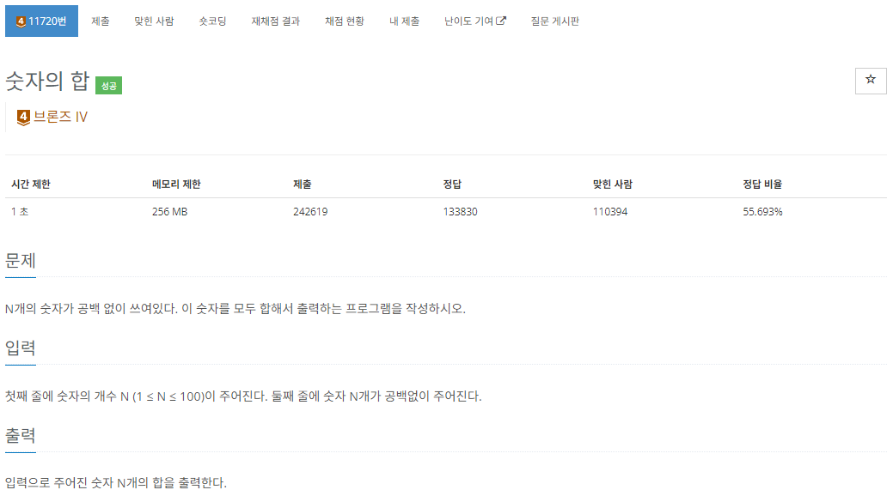
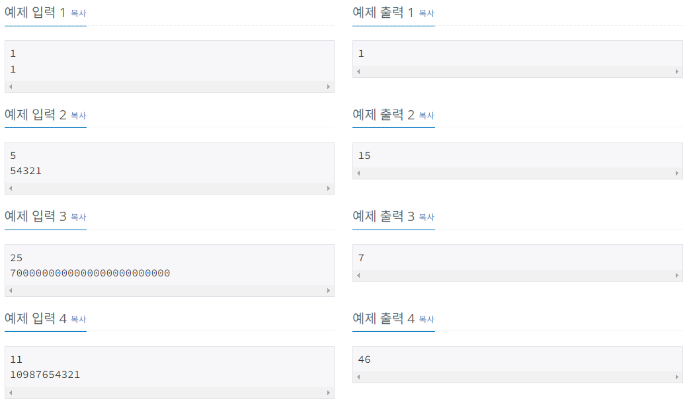
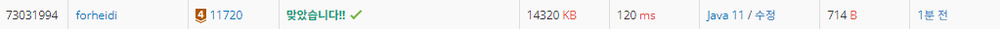
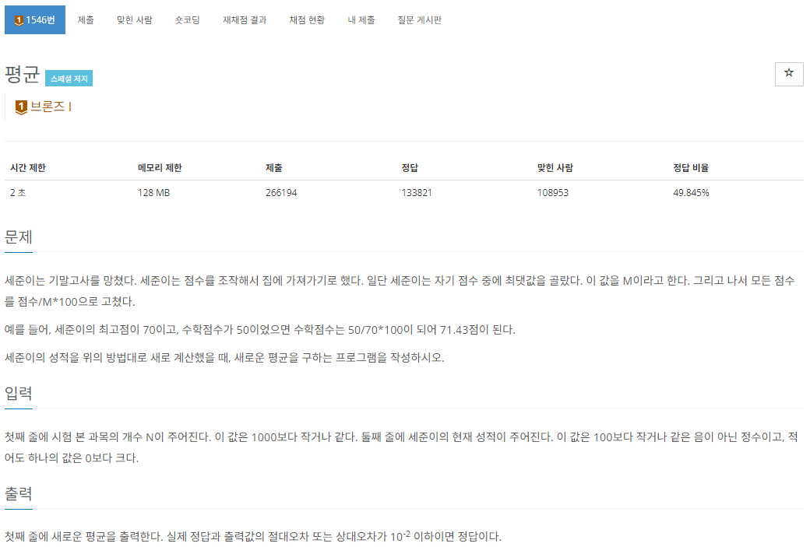
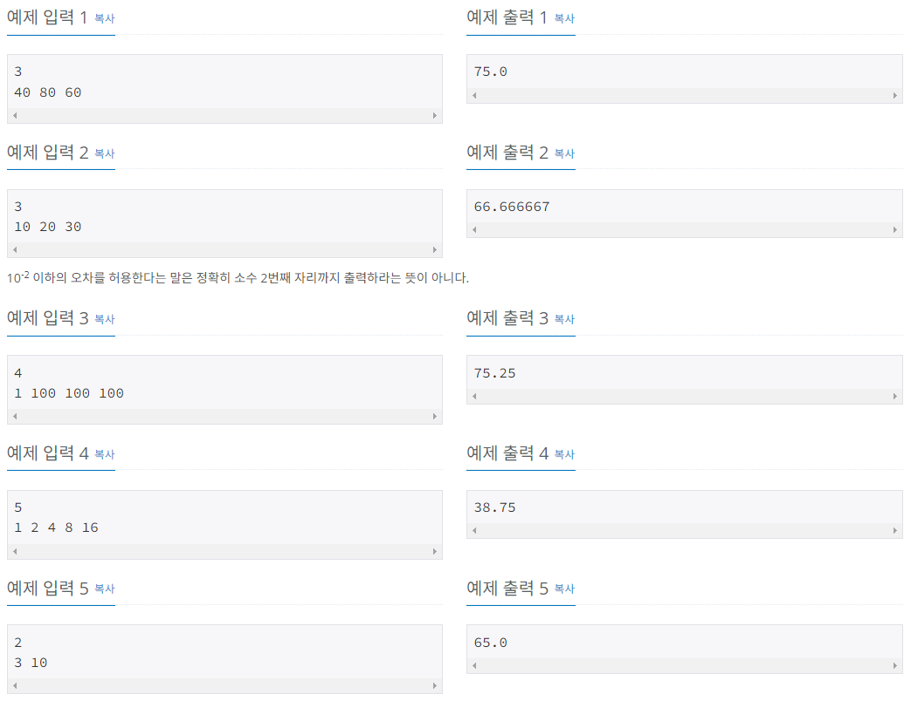
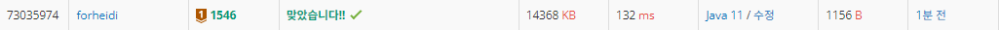

# 배열과 리스트

Created date: 2024년 2월 6일

 

<aside>
💡 배열과 리스트는 가장 흔히 쓰이는 자료구조인만큼 코딩 테스트에서도 자주 쓰이게 된다 
— 두 개의 차이점을 이해하고 알맞게 사용하자

</aside>

 

# 01 배열과 리스트

## 배열

- 메모리의 연속 공간에 값이 채워져 있는 형태의 자료구조
- 인덱스를 통해 값을 참조 가능
- 새로운 값을 삽입하거나 특정 인덱스에 있는 값을 삭제하기 어려움
    - shift 연산이 필요
- 배열의 크기는 선언 시 지정할 수 있으며, 한 번 선언하면 크기를 늘리거나 줄일 수 없음
- 구조가 간단하므로 코딩테스트에서 많이 사용

## 리스트

- 값과 포인터를 묶은 노드라는 것을 포인터로 연결한 자료구조
- 인덱스가 없으므로 값에 접근하려면 Head 포인터부터 순서대로 접근해야 함
    - 값에 접근하는 속도가 느림
- 포인터로 연결되어 있으므로 데이터를 삽입하고 삭제하는 연산 속도가 빠름
- 선언할 때 크기를 지정하지 않아도 됨
    - 크기가 정해져있지 않으며 크기가 변하기 쉬움
- 포인터를 저장할 공간이 필요해 배열보다 구조가 복잡

### 자바의 리스트

- ArrayList
    - 가장 많이 쓰는 리스트
- LinkedList

## 어떤 기준으로 무엇을 쓸 지 결정할까?

- 배열을 사용하는 경우
    - 크기가 정해져 있는 데이터
    - 데이터에 접근하는 경우가 많을 때
- 리스트를 사용하는 경우
    - 크기가 변하는 데이터
    - 데이터의 삽입/삭제가 많을 때

 

# 실전 문제 - 숫자의 합 (11720)

## 문제

[https://www.acmicpc.net/problem/11720](https://www.acmicpc.net/problem/11720)

## 풀이

String으로 입력받고 toCharArray해서 배열에 넣어서 하나씩 빼서 sum에 더함

근데 이렇게 하면 N을 안써도됨 이래도되나? 되겠지뭐..

### 첫번째 시도: 맞았습니다!!

## 후기

- Do it! 알고리즘 코딩 테스트 with 자바 보면서 풀게 된 문제인데
- 간단해보여도 생각해야될게 많은듯..

나는 배열과 리스트 강의를 보다가 와서 그런지 당연히 String으로 받고 char 배열로 바꿔서 썼지만

그냥 딱 문제를 받는 사람들은.. int로 받아서 1000을 나눈 나머지와 100을 나눈 나머지와 10을 나눈 나머지… 이런 연산을 통해 답을 구하는 로직으로 접근할 수도 있다고 함 (난 애초에 생각이 이렇게 수학적으로 안가긴하는데)

근데 저렇게 접근하면 문제가 N이 100까지 갈 수 있다는 것

N이 100이면 100자리 수인데.. 그럴 경우 int에도 long에도 못담음

때문에!!!!! 간단해보이는 문제여도 주어진 조건들을 꼼꼼히 보면서 문제를 분석한 후 완벽히 분석이 되었을때 코딩으로 들어가라

- 풀고 나서 강의에 문제 분석 살짝.. 봤는데 내가 푼 방식대로 푸는게 맞는듯

 

# 실전 문제 - 평균 (1546)

## 문제

[https://www.acmicpc.net/problem/1546](https://www.acmicpc.net/problem/1546)

## 풀이

### 첫번째 시도: 맞았습니다!!

## 후기

- 아 나는 하나하나씩 변환한 다음에 그걸 더하고 나눠서 평균을 구했는데
- 원래 값이 들어있는 배열을 쭉 돌면서 최댓값을 구하는 동시에 sum을 만들고 그 sum을 변환해서 평균을 구하면 더 빠르게 할 수 있는듯
- 맞네..