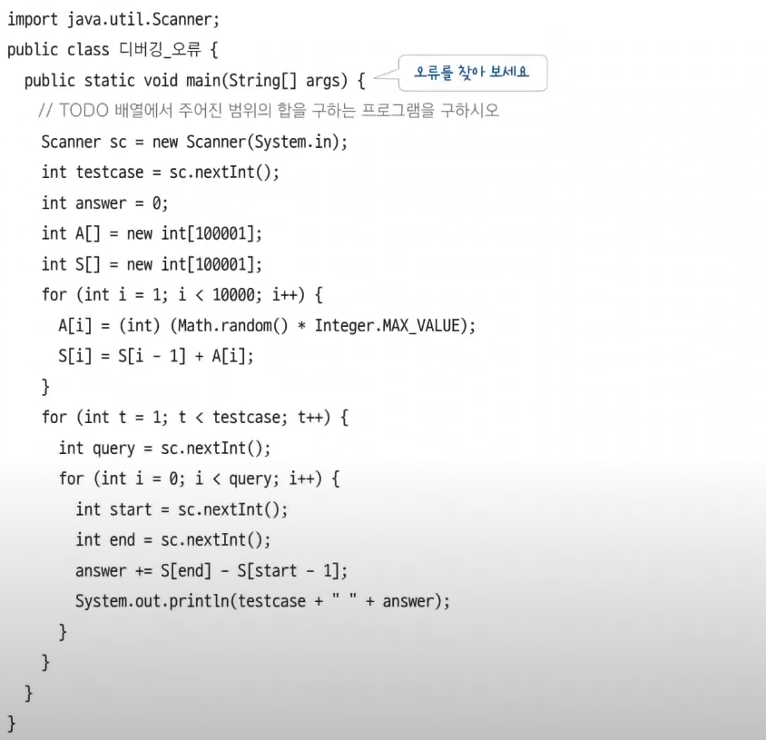

# 디버깅

 

<aside>

💡 코드의 논리 오류를 어떻게 잡을까? 
— 가장 뛰어난 오류 탐색 방법, 디버깅

</aside>

 

# 01 디버깅은 왜 중요할까?

프로그램의 문법 오류나 논리 오류를 찾아 바로잡는 과정

문법 오류는 컴파일러가 자동으로 찾아 주므로 테스트 시 문제가 되지 않는데, 논리 오류는 코드가 사용자의 의도와 다르게 동작하는 것이며 다양한 형태로 발생

## 디버깅의 중요성

- index 범위를 잘못 지정했을 때
- 변수 타입(int vs long)을 잘못 지정했을 때

이런 경우 디버깅을 제대로 했다면 빠르게 문제를 파악하고 고칠 수 있음

⇒ 디버깅은 코딩 테스트에 필요한 기술이고, 그냥 알아 두기만 하면 되는 게 아니라 문제를 풀며 반드시 해야 하는 과정이므로 디버깅을 익힌 후 코딩 테스트에 응시해라

## 디버깅 하는 법

1. 코드에서 디버깅하고자 하는 줄에 중단점을 설정 (여러 개 설정 가능)
2. IDE의 디버깅 기능을 실행하면 코드를 1줄씩 실행하거나 다음 중단점까지 실행 가능
    1. 이 때 추적할 변숫값도 지정 가능 → 변숫값이 자신이 의도한 대로 바뀌는지 파악
3. 변숫값 이외에도 원하는 수식을 입력해 논리 오류를 파악할 수 있음

 

# 02 디버깅 활용 사례 살펴보기

## 코딩 테스트를 진행하며 실수하기 쉬운 4가지 오류 찾아보기

### 오류 1. 변수 초기화 오류

- answer의 초기화 위치가 잘못됨 중첩 for문의 첫번째 for문에서 초기화가 시행되어야 함

### 오류 2. 반복문에서 인덱스 범위 지정 오류

- 배열을 10만 크기로 만들었으나 초기화는 10000번째까지만 시행함
- 로그보다 디버깅이 좋은 이유
    - 코딩 테스트는 한번 내에 문제를 풀지 못할 경우 그 뒤는 시간싸움임
    - 시간싸움에서 로그보다 디버깅이 더 유리함

### 오류 3. 잘못된 변수 사용 오류

- 마지막 sout에서 testcase가 아니라 t를 출력해야 함

### 오류 4. 자료형 범위 오류

- 로직이 완벽한데 음수가 나오면 안되는 경우에 음수가 나올 때 int형을 long형으로 바꿔봐라
- 음수가 찍히는 이유?
    - int형이 표현할 수 있는 범위는 -2147483648~2147483647인데 이 범위를 넘어가게 되면 반대쪽끝으로 가서 표현하나봄
    - 그래서 처음부터 long으로 선언하는게 좋긴한데 잘 안됨 이미 int에 익숙해져있고 편하니까
- 팩토리얼/경우의수/순열/DP의 경우에는 long을 사용해보자