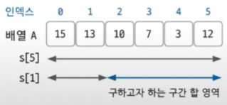
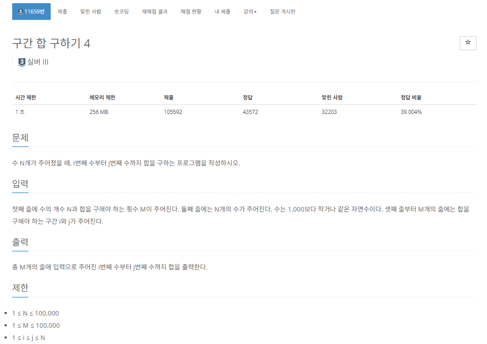
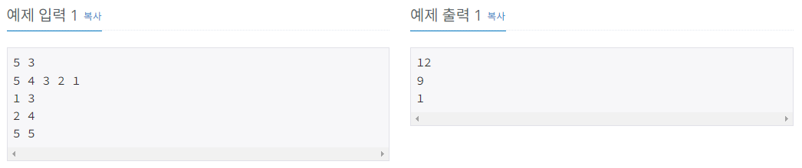

# 구간 합

Created date: 2024년 2월 7일

 

<aside>

💡 구간 합은 여러 코딩 테스트 문제에서 자주 사용되는 핵심 개념 
— 합 배열을 이용해 시간 복잡도를 더 줄이기 위해 사용하는 특수한 목적의 알고리즘

</aside>

 

# 01 합 배열

> **합 배열 S 정의**  
S[i] = A[0] + A[1] + A[2] + ... + A[i-1] + A[i]
> 
- 기존의 배열을 전처리한 배열
- 합 배열을 미리 구해 놓으면 기존 배열의 일정 범위의 합을 구하는 시간 복잡도가 $O(n)$에서 $O(1)$로 감소

> **합 배열 S를 만드는 공식**  
S[i] = S[i-1] + A[i]  
(단, S[0] = A[0])
> 

 

# 02 구간 합

> **구간 합을 구하는 공식**  
i에서 j까지의 구간 합을 구하는 공식은  
S[j] - S[i-1]
> 

- 합 배열만 미리 구해 두면 구간 합은 한 번의 계산으로 구할 수 있음

 

# 실전 문제 - 구간 합 구하기 4 (11659)

## 문제

[https://www.acmicpc.net/problem/11659](https://www.acmicpc.net/problem/11659)

## 풀이

위의 내용 참고해서 푸니까 바로 풀림

입력 받는 수는 1,000보다 작거나 같은 수이지만 입력받는 개수는 100,000까지도 가능하므로 합 배열 S는 long형으로 만들었다면 더 좋았을듯