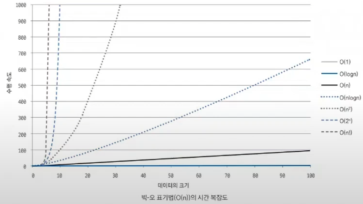
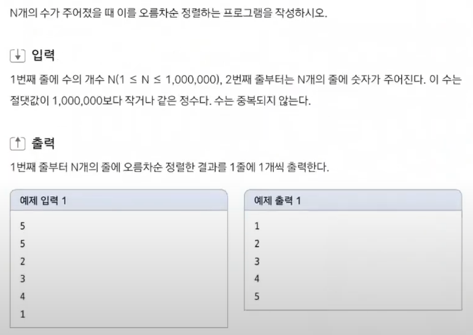

# 시간복잡도

Created date: 2024년 2월 3일

 

<aside>

💡 어떤 알고리즘으로 풀어야 할까?  
— 알고리즘 선택의 기준이 되는 시간 복잡도

</aside>

 

# 01 시간 복잡도 표기법

알고리즘에서 시간 복잡도란 주어진 문제를 해결하기 위한 연산 횟수

일반적으로 수행 시간은 1억 번의 연산을 1초의 시간으로 간주해 예측

## 시간 복잡도 정의하기

시간 복잡도는 아래의 세가지 유형으로 나뉨

- 빅-오메가($Ω(n)$): 최선일 때의 연산 횟수를 나타낸 표기법
- 빅-세타($θ(n)$): 보통일 때의 연산 횟수를 나타낸 표기법
- 빅-오($O(n)$): 최악일 때의 연산 횟수를 나타낸 표기법

## 실제 코딩 테스트에서는 어떤 시간 복잡도 유형을 사용할까?

빅-오($O(n)$) 표기법을 기준으로 수행 시간을 계산하는 것이 좋다

즉 가장 최악의 경우를 염두에 두고 코드를 짜야 한다는 것

 

# 02 시간 복잡도 활용하기

## 알고리즘 선택의 기준으로 사용

시간 복잡도를 따질때는 항상 데이터의 개수를 먼저 봐야 함

### 연습문제 000 수 정렬하기

- 위의 문제에서 가능한 데이터의 개수는 백만개(이정도면 컴퓨터에서는 아주 많지도 적지도 않은 적당한 숫자라고 함)
- 예제의 경우는 데이터의 개수가 아주 작기 때문에 어떤 알고리즘을 써도 괜찮겠지만 만약 데이터가 백만개가 들어온다면? 백만개가 들어올 경우를 생각해 알고리즘을 선택해야 함
- 문제의 제한 시간은 2초
    - 2억 번 이하의 연산 횟수로 문제를 해결해야 함

> **연산 횟수 계산 방법**
연산 횟수 = 알고리즘 시간 복잡도 * 데이터의 크기
> 

> **알고리즘 적합성 평가**  
버블 정렬 = $(1,000,000)^2=1,000,000,000,000>200,000,000$ → 부적합 알고리즘  
병합 정렬 = $1,000,000log(1,000,000)=$ 약 $2,000,000<200,000,000$ → 적합 알고리즘
> 

## 시간 복잡도를 바탕으로 코드 로직 개선

> **시간 복잡도 도출 기준**  
    1. 상수는 시간 복잡도 계산에서 제외  
    2. 가장 많이 중첩된 반복문의 수행 횟수가 시간 복잡도의 기준
> 

- 상수는 시간 복잡도 계산에서 제외 한다는 이야기는
    - for문이 1개인 코드($O(N)$)와 for문이 3개인 코드($O(3N)$)의 시간 복잡도는 상수를 제외한 $O(N)$으로 동일하다는 이야기임
    - for문이 중첩되어 있는 경우에는 $O(N^2)$

⇒ 일반 for문이 10개 있다고 하더라도 중첩 for문의 수행 횟수에 의해 시간 복잡도가 결정

 

# 총정리

시간 복잡도는

1. 알맞은 알고리즘을 선택하는 기준
2. (문제를 풀다가 시간 초과가 발생했을 때) 비효율적인 로직을 찾아서 효율적으로 바꿀 수 있음