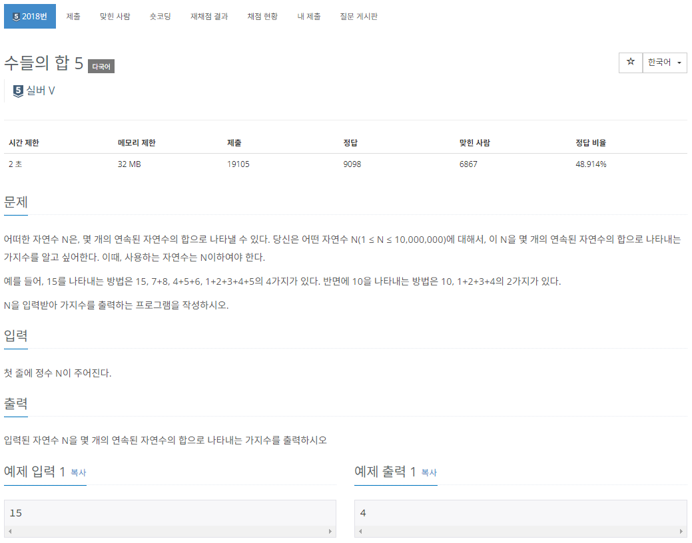
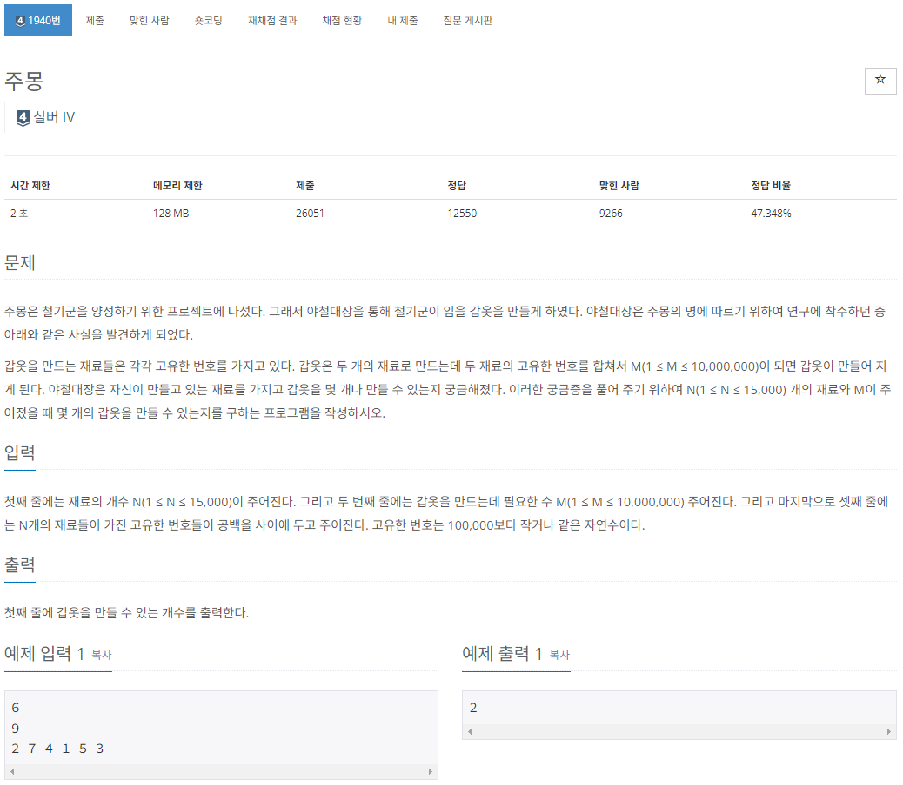

# 투 포인터

Created date: 2024년 2월 18일

 

# 01 투 포인터

- 2개의 포인터로 알고리즘의 시간 복잡도를 최적화하는 방식
- 매우 간단한 알고리즘이므로 문제를 풀며 이해

 

# 실전 문제 - 수들의 합 5

## 문제

[https://www.acmicpc.net/problem/2018](https://www.acmicpc.net/problem/2018)

## 풀이

### 문제 분석

- N의 최댓값이 10,000,000이므로 $O(nlogn)$의 시간 복잡도 알고리즘을 사용하면 제한 시간 2초를 벗어나게 됨
- 때문에 $O(n)$의 시간 복잡도 알고리즘을 사용해야 함
- 이 때 많이 사용하는 것이 투 포인터 알고리즘

### 손으로 풀어보기

1. 입력받은 값을 N에 저장한 후 사용할 변수와 배열을 모두 초기화
    - 이 때 배열은 index 1에 1이 들어가도록 초기화 (index 0은 사용하지 않음)
    - 결과 변수 count를 1로 초기화: 숫자 N만 뽑는 경우의 수는 미리 넣고 초기화
    - start_index와 end_index를 모두 1로 초기화
    - sum을 1로 초기화(start_index와 end_index가 모두 1에서 시작하므로 초기 sum은 1)
2. 아래의 투 포인터 이동 원칙을 활용해 배열의 끝까지 탐색하며 합이 N이 될 경우의 수를 구함
    - 이게 sum을 매번 구하는 게 아니라 이미 구한거에 빼고 더하고 하면서 포인터를 이동하는 듯

> **투 포인터 이동 원칙**  
sum > N: sum = sum - start_index; start_index++;  
sum < N: end_index++; sum = sum + end_index;  
sum == N: end_index++; sum = sum + end_index; count++;
> 
3. end_index가 N이 되면 종료

 

# 실전 문제 - 주몽 (1940)

## 문제

[https://www.acmicpc.net/problem/1940](https://www.acmicpc.net/problem/1940)

## 풀이

포인터 초기 값 바꾸고.. 그거에 맞게 알고리즘도 바꾸고 하니까 쉽게 풀림