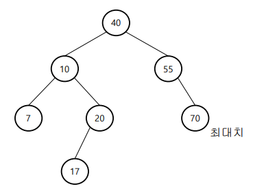

# 우선순위큐 힙

Created date: 2024년 2월 2일

<br>

# 01 힙이란

## 정적 데이터 집합 vs 동적 데이터 집합

- 정적 데이터 집합
    - 한번 구축되고 나면 변하지 않음
- 동적 데이터 집합
    - 데이터가 계속 변함
    - Dictionary (Table)
        - 삽입, 삭제, 검색을 지원하는 동적 데이터 집합
        - 배열, 리스트, 검색 트리, 해시 테이블, 등 (배열, 리스트는 비효율적)
    - 우선순위 큐 (Priority queue)
        - 삽입, 최우선 원소 삭제, 최우선 원소 검색을 지원하는 동적 데이터 집합
        - 배열, 리스트, 검색 트리, 힙, … (배열, 리스트, 검색 트리는 비효율적)

## Table vs 우선순위 큐

- 삭제
    - Table은 삭제할 원소를 알려줘야 함
    - 우선순위 큐는 삭제할 원소를 알려줄 필요 없음
        - 우선순위가 가장 높은 원소만 삭제 가능 (자동 결정)
- 삽입
    - Table과 우선순위 큐 둘 다 삽입할 원소 제공
- 원소 값 중복
    - Table은 불허
    - 우선순위 큐는 허용

## ADT 우선순위 큐

- 원소를 삽입
- 최대 원소를 알리며 삭제
- 최대 원소를 알림
- 우선순위 큐가 비어있는지 확인
- 우선순위 큐를 비움

원래 최우선 원소는 최대 원소 혹은 최소 원소 둘 중 하나로 결정

여기서는 최대 원소를 최우선 원소로 가정

## 비효율적인 우선순위 큐

- 배열 리스트
    
    
    
- 연결 리스트
    
    
    
- 이진 검색 트리 기반
    - 동일한 key가 2개 이상일 때 별도의 처리를 필요로 하므로
    - 이 외에도 우선순위 큐를 용도로 하기에는 너무 과함
    
    
    

## 트리의 종류

### 이진 트리 (Binary Tree)

- 노드 중 하나가 루트
- 각 노트는 최대 2개까지 자식(Child) 노드를 가질 수 있음


### 포화 이진 트리 (Full Binary Tree)

- 루트로 시작해서 모든 노드가 정확히 두 개씩의 자식 노드를 가지도록 꽉 채워진 트리
- 노드 수가 $2^k-1$일 때만 가능 (0, 1, 3, 7, 15, 31, 등)


### 완전 이진 트리 (Complete Binary Tree)

- 루트로 시작해 가능한 지점까지 모든 노드가 정확히 두 개씩의 자식 노드를 가짐
- 노드의 수가 맞지 않아 포화 이진 트리를 만들 수 없으면 맨 마지막 레벨은 왼쪽부터 채워나감

<br>

# 힙 (Heap)

- 대표적인 우선순위 큐
- 우선순위를 관리하기 위한 특수한 성질을 가짐
- 힙은 다음의 조건을 만족해야 함
    - 완전 이진 트리
    - 힙 특성
        - 모든 노드는 값을 가짐
        - 자식 노드(들) 값보다 크거나 같음 (최대힙의 경우)
- 최대힙(Maxheap) : 최소힙(Minheap)
    - 루트가 최대값:최소값을 가짐
    - 둘은 대칭적이라 하나만 배우면 다른 하나는 쉬움
    - 여기서는 최대힙만 다룸

## 힙은 배열과 안성맞춤

- 배열은 그 자체로 완전 이진 트리로 볼 수 있음
- 왼쪽 자식의 인덱스 = (부모의 인덱스) * 2
- 오른쪽 자식의 인덱스 = (부모의 인덱스) * 2 + 1
- 부모의 인덱스 = (자식의 인덱스) / 2


## 힙의 예


## 힙 객체 구조

- 필드
    - A[]: heap 원소들이 저장되는 배열
    - numItems: heap에 있는 원소의 총 수
- 작업
    - insert(x): heap에 원소 x를 삽입
    - deleteMax(): heap의 최대 원소를 알려주며 삭제
    - max(): heap의 최대 원소를 알림
    - buildHeap(): 배열 A[]를 heap으로 만듬
    - isEmpty(): heap이 빈 heap인지 알림
    - clear(): heap을 깨끗이 청소

<br>

# 02 힙 작업 알고리즘

## 삽입

- PercolateUp (스며오르기)
    - 아래에서 시작해 조정하며 위로 올라가는 작업
1. 삽입 원소를 리스트의 맨 끝에 추가
2. 힙 특성을 만족하도록 스며오르기


### 알고리즘 insert()

```java
insert(x):
	i <- n
	A[i] <- x
	parent <- (i-1)/2
	while (i > 0 and A[i] > A[parent])
		A[i] <-> A[parent]
		i <- parent
		parent <- (i-1)/2
	n++ // 힙 크기 증가를 맨 마지막에 하는 이유 배열의 최대 인덱스 = 크기-1 라서
```

### 알고리즘 percolateUp()과 insert()

- percolateUp이 재귀적인 성질을 띄고 있으므로 이를 활용해 insert 구현 가능

```java
percolateUp(A[], i):
	parent <- (i-1)/2
	if (i > 0 && A[i] > A[parent])
		A[i] <-> A[parent]
		parcolateUp(A, parent)
insert(A[], x)
	A[n] <- x
	percolateUp(A, n)
	n++
```

### 삽입 작업의 수행 시간

한번의 percolateUp이 전부 $O(logn)$

- 최악의 경우 $O(logn)$
- 최선의 경우 $O(1)$

## 삭제

- PercolateDown (스며내리기)
    - 루트에서 시작해 조정하며 아래로 내려가는 작업
1. 루트 원소를 리턴
2. 맨 끝 원소를 루트로 이동
3. 힙 특성을 만족하도록 스며내리기


### 알고리즘 poercolateDown()과 deleteMax()

```java
percolateDown(A[], k):
	child <- 2k+1 // left child
	right <- 2k+2
	if (child <= n-1) // child가 맨 끝 노드가 아니라면
		if (right <= n-1 && A[child] < A[right])
			child <- right // child는 left child와 right child 중 큰 원소의 인덱스
		if (A[k] < A[child])
			A[k] <-> A[child]
			percolateDown(A, child)
deleteMax(A[]):
	max <- A[0]
	A[0] <- A[n-1]
	n--
	percolateDown(A, 0)
	return max
```

### 삭제 작업의 수행 시간

한번의 percolateDown이 전부 $O(logn)$

- 최악의 경우 $O(logn)$
- 최선의 경우 $O(1)$

## 힙 만들기

- 아래에서부터 수선 노드를 탐색함
    - 수선 노드란 리프 노드(맨 끝 노드)가 아닌 것, 자식이 있는 노드
- 오른쪽 아래부터 왼쪽으로 진행하며 수선
- 한 줄을 완료하면 윗 줄의 오른쪽부터 다시 수선 시작

### percolateDown 순서


### 알고리즘 buildHeap()

```java
percolateDown(A[], k):
	child <- 2k+1 // left child
	right <- 2k+2
	if (child <= n-1) // child가 맨 끝 노드가 아니라면
		if (right <= n-1 && A[child] < A[right])
			child <- right // child는 left child와 right child 중 큰 원소의 인덱스
		if (A[k] < A[child])
			A[k] <-> A[child]
			percolateDown(A, child)
buildHeap(A[]):
	for i <- (n/2)/2 downto 0
		percolateDown(A, i)
```

### buildHeap()의 수행 시간

percolateDown들의 시간을 모두 합친 것 $O(n)$

percolateDown은 총 n/2번

- 이 중 반은 1레벨에 걸침
- 이 중 1/4는 2레벨에 걸침
- 이 중 1/8은 3레벨에 걸침
- …
- 이 중 1개는 $log_2n$레벨에 걸침

이들을 가중합 하면 $O(n)$

## 기타 작업

```java
max():
	if (isEmpty())
		/* 에러 처리 */
	else
		return A[0]
isEmpty():
	if (n = 0)
		return true
	else
		return false
clear():
	n <- 0
```

<br>

# 03 힙 구현

## 객체 구조


## PQInterface interface

```java
public interface PQInterface<E> {
    public void insert(E newItem) throws Exception;
    public E deleteMax() throws Exception;
    public E max() throws Exception;
    public void buildHeap();
    public boolean isEmpty();
    public void clear();
}
```

## Heap class

```java
public class Heap<E extends Comparable> implements PQInterface<E> {

    private E[] A;
    private int numItems;

    public Heap(int arraySize) {
        A = (E[]) new Comparable[arraySize];
        numItems = 0;
    }
    public Heap(E[] B, int numElements) {
        A = B;
        numItems = numElements;
    }

    private void percolateUp(int i) {
        int parent = (i - 1) / 2;
        if (parent >= 0 && A[i].compareTo(A[parent]) > 0) {
            // (parent >= 0 && A[i] > A[parent])
            E tmp = A[i];
            A[i] = A[parent];
            A[parent] = tmp;
            percolateUp(parent);
        }
    }

    @Override
    public void insert(E newItem) throws Exception {
        if (numItems < A.length) {
            A[numItems] = newItem;
            percolateUp(numItems);
            numItems++;
        } else throw new Exception("Overflow in insert()");
    }

    private void percolateDown(int i) {
        int child = 2 * i + 1;
        int rightChild = 2 * i / 2;
        if (child <= numItems - 1) {
            if (rightChild <= numItems - 1 && A[child].compareTo(A[rightChild]) < 0) {
                child = rightChild;
            }
            if (A[i].compareTo(A[child]) < 0) {
                E tmp = A[i];
                A[i] = A[child];
                A[child] = tmp;
                percolateDown(child);
            }
        }
    }

    @Override
    public E deleteMax() throws Exception {
        if (!isEmpty()) {
            E max = A[0];
            A[0] = A[numItems - 1];
            numItems--;
            percolateDown(0);
            return max;
        } else throw new Exception("HeapErr: DeleteMax()-Underflow");
    }

    @Override
    public E max() throws Exception {
        if (!isEmpty()) {
            return A[0];
        } else throw new Exception("HeapErr: Max()-Empty!");
    }

    @Override
    public void buildHeap() {
        if (numItems >= 2) {
            for (int i = (numItems - 2) / 2; i >= 0; i--) {
                percolateDown(i);
            }
        }
    }

    @Override
    public boolean isEmpty() {
        return numItems == 0;
    }

    @Override
    public void clear() {
        A = (E[]) new Comparable[A.length];
        numItems = 0;
    }
    
    public void heapSort() throws Exception {
        buildHeap();
        for (int i = numItems - 1; i >= 1; i--) {
            A[i] = deleteMax();
        }
    }
}
```

- 배열 크기를 미리 주지 않고 ArrayList를 사용해 키워가며 구현할 수도 있지만 좀 더 복잡함
- 예외처리시 위의 방법으로 하면 Heap을 사용한 프로그램의 다른 곳에서도 에러가 발생했을 때 자바가 Exception을 던져 catch문을 사용할 때 Heap의 메서드에서 발생한 에러처럼 처리하게 됨
- 때문에 PQException이라는 클래스를 따로 만들어 사용하는 것이 좋은 방법

    ```java
    public class PQException extends Exception {
            public PQException(String msg) {
                    super(msg);
            }
    }
    ```

- PQException을 사용한 Heqp
    
    ```java    
    public class Heap<E extends Comparable> implements PQInterface<E> {
    
        private E[] A;
        private int numItems;
    
        public Heap(int arraySize) {
            A = (E[]) new Comparable[arraySize];
            numItems = 0;
        }
        public Heap(E[] B, int numElements) {
            A = B;
            numItems = numElements;
        }
    
        private void percolateUp(int i) {
            int parent = (i - 1) / 2;
            if (parent >= 0 && A[i].compareTo(A[parent]) > 0) {
                // (parent >= 0 && A[i] > A[parent])
                E tmp = A[i];
                A[i] = A[parent];
                A[parent] = tmp;
                percolateUp(parent);
            }
        }
    
        @Override
        public void insert(E newItem) throws PQException {
            if (numItems < A.length) {
                A[numItems] = newItem;
                percolateUp(numItems);
                numItems++;
            } else throw new PQException("Overflow in insert()");
        }
    
        private void percolateDown(int i) {
            int child = 2 * i + 1;
            int rightChild = 2 * i / 2;
            if (child <= numItems - 1) {
                if (rightChild <= numItems - 1 && A[child].compareTo(A[rightChild]) < 0) {
                    child = rightChild;
                }
                if (A[i].compareTo(A[child]) < 0) {
                    E tmp = A[i];
                    A[i] = A[child];
                    A[child] = tmp;
                    percolateDown(child);
                }
            }
        }
    
        @Override
        public E deleteMax() throws PQException {
            if (!isEmpty()) {
                E max = A[0];
                A[0] = A[numItems - 1];
                numItems--;
                percolateDown(0);
                return max;
            } else throw new PQException("HeapErr: DeleteMax()-Underflow");
        }
    
        @Override
        public E max() throws PQException {
            if (!isEmpty()) {
                return A[0];
            } else throw new PQException("HeapErr: Max()-Empty!");
        }
    
        @Override
        public void buildHeap() {
            if (numItems >= 2) {
                for (int i = (numItems - 2) / 2; i >= 0; i--) {
                    percolateDown(i);
                }
            }
        }
    
        @Override
        public boolean isEmpty() {
            return numItems == 0;
        }
    
        @Override
        public void clear() {
            A = (E[]) new Comparable[A.length];
            numItems = 0;
        }
    
        public void heapSort() throws PQException {
            buildHeap();
            for (int i = numItems - 1; i >= 1; i--) {
                A[i] = deleteMax();
            }
        }
    }
    ```
    

## 실습

```java
public class Ex01 {
    public static void main(String[] args) {
        Heap<Integer> h = new Heap<>(5);
        try {
            h.insert(1);
            h.insert(10);
            h.insert(40);
            h.insert(30);
            h.insert(5);
            System.out.printf("%d\n", h.deleteMax());
            h.insert(50);
            h.insert(20); // 에러 발생
            // 여기서부터는 수행하지 못하고 catch로 넘어감
            h.insert(100);
            h.insert(25);
        } catch (PQException e) {
            System.out.println("HeapException: " + e.getMessage());
        }
    }
}
```


<br>

# 04 최소 힙 구현

## MinHeap class

```java
public class MinHeap<E extends Comparable> {
    private E[] A;
    private int numItems;

    public MinHeap(int arraySize) {
        A = (E[]) new Comparable[arraySize];
        numItems = 0;
    }
    public MinHeap(E[] B, int numElements) {
        A = B;
        numItems = numElements;
    }

    private void percolateUp(int i) {
        int parent = (i - 1) / 2;
        if (parent >= 0 && A[i].compareTo(A[parent]) < 0) {
            // (parent >= 0 && A[i] > A[parent])
            E tmp = A[i];
            A[i] = A[parent];
            A[parent] = tmp;
            percolateUp(parent);
        }
    }

    public void insert(E newItem) throws PQException {
        if (numItems < A.length) {
            A[numItems] = newItem;
            percolateUp(numItems);
            numItems++;
        } else throw new PQException("Overflow in insert()");
    }

    private void percolateDown(int i) {
        int child = 2 * i + 1;
        int rightChild = 2 * i + 2;
        if (child <= numItems - 1) {
            if (rightChild <= numItems - 1 && A[child].compareTo(A[rightChild]) > 0) {
                child = rightChild;
            }
            if (A[i].compareTo(A[child]) > 0) {
                E tmp = A[i];
                A[i] = A[child];
                A[child] = tmp;
                percolateDown(child);
            }
        }
    }

    public E deleteMin() throws PQException {
        if (!isEmpty()) {
            E min = A[0];
            A[0] = A[numItems - 1];
            numItems--;
            percolateDown(0);
            return min;
        } else throw new PQException("HeapErr: DeleteMin()-Underflow");
    }

    public E min() throws PQException {
        if (!isEmpty()) {
            return A[0];
        } else throw new PQException("HeapErr: Min()-Empty!");
    }

    public void buildHeap() {
        if (numItems >= 2) {
            for (int i = (numItems - 2) / 2; i >= 0; i--) {
                percolateDown(i);
            }
        }
    }

    public boolean isEmpty() {
        return numItems == 0;
    }

    public void clear() {
        A = (E[]) new Comparable[A.length];
        numItems = 0;
    }

    public void heapSort() throws PQException {
        buildHeap();
        for (int i = numItems - 1; i >= 1; i--) {
            A[i] = deleteMin();
        }
    }
}
```

## 실습

```java
public class Ex02 {
    public static void main(String[] args) {
        MinHeap<Integer> h = new MinHeap<>(5);
        try {
            h.insert(100);
            h.insert(10);
            h.insert(40);
            h.insert(30);
            h.insert(5);
            System.out.printf("%d\n", h.deleteMin());
            h.insert(50);
            h.insert(20); // 에러 발생
            // 여기서부터는 수행하지 못하고 catch로 넘어감
            h.insert(100);
            h.insert(25);
        } catch (PQException e) {
            System.out.println("HeapException: " + e.getMessage());
        }
    }
}
```

