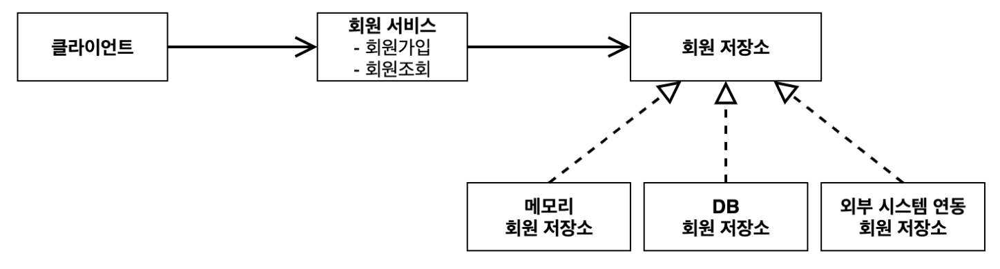

# 스프링 핵심 원리 이해1 - 예제 만들기

> 이번 시간에는 …
> 
> - 지금까지 우리가 배운대로 역할(인터페이스)와 구현(객체)로 나누어서 개발을 해볼건데
> - 순수한 자바로만 개발할 것
> - 이후 회원 도메인, 주문, 할인 등의 도메인을 섞어 예제를 하나 만들어 볼 것
> - 이로써 자바로만 개발했을 때 수정사항이 생기면 유연하게 대처할 수 있는지 확인

<br>

# ✏️ 프로젝트 생성

### 사전 준비물

- Java 17
- IntelliJ or Eclipse

### 스프링 부트 스타터 사이트로 이동해 스프링 프로젝트 생성

- 스프링을 사용 안한다고 하긴 했지만 환경 세팅은 스프링으로 하는 게 편하기 때문에 사용

[https://start.spring.io](https://start.spring.io)

- 프로젝트 선택
    - Project: **Gradle - Groovy** Project
    - Spring Boot: 3.2.3
    - Language: Java
    - Packaging: Jar
    - Java: 17
- Project Metadata
    - groupId: hello
    - artifactId: core
- Dependencies: 선택하지 않는다.

### 동작 확인

- 기본 메인 클래스(CoreApplication.main()) 실행

<br>

# ✏️ 비즈니스 요구사항과 설계

- 회원
    - 회원을 가입하고 조회할 수 있다.
    - 회원은 일반과 VIP 두 가지 등급이 있다.
    - 회원 데이터는 자체 DB를 구축할 수 있고, 외부 시스템과 연동할 수 있다. (미확정)
- 주문과 할인 정책
    - 회원은 상품을 주문할 수 있다.
    - 회원 등급에 따라 할인 정책을 적용할 수 있다.
    - 할인 정책은 모든 VIP는 1000원을 할인해주는 고정 금액 할인을 적용해달라. (나중에 변경 될 수 있다.)
    - 할인 정책은 변경 가능성이 높다. 회사의 기본 할인 정책을 아직 정하지 못했고, 오픈 직전까지 고민을 미루고 싶다. 최악의 경우 할인을 적용하지 않을 수 도 있다. (미확정)

요구사항을 보면 지금 결정하기 어려운 부분이 많은데, 이러한 것들이 결정될 때 까지 개발을 연기할 수 없음

때문에 객체 지향 설계를 활용해 인터페이스와 구현체로 나누어 설계해보자

<br>

# ✏️ 회원 도메인 설계

- 회원 도메인 요구사항
    - 회원을 가입하고 조회할 수 있다.
    - 회원은 일반과 VIP 두 가지 등급이 있다.
    - 회원 데이터는 자체 DB를 구축할 수 있고, 외부 시스템과 연동할 수 있다. (미확정)

### 회원 도메인 협력 관계



- 일단 가장 간단한 메모리 회원 저장소로 개발 진행

### 회원 클래스 다이어그램


### 회원 객체 다이어그램


- 회원 서비스: MemberServiceImpl

### 항상 그림이 개념적으로 위의 3개로 그려짐

- 도메인 협력 관계
    - 기획자들도 볼 수 있는 그림
- 클래스 다이어그램
    - 도메인 협력 관계를 바탕으로 개발자들이 구체화해 만들어낸 그림
    - 실제 서버를 실행하지 않고 클래스들만 볼 수 있는 그림
    - 근데 이제 구현체들은 동적으로 결정되므로 클래스 다이어그램만으로는 실제로 사용하는 객체를 파악하기 어려움
- 객체 다이어그램
    - 실제로 사용하는 객체들을 나타낸 그림

<br>

# ✏️ 회원 도메인 개발

<aside>

💡 백문이 불여일타 <br>
백번 보는 것 보다 직접 코드를 치는 것이 훨씬 효과적임 <br>
꼭 직접 코드를 쳐봐라!! 

</aside>

## 회원 엔티티

### 회원 등급

```java
package hello.core.member;

public enum Grade {
    BASIC,
    VIP
}
```

### 회원 엔티티

```java
package hello.core.member;

public class Member {

    private Long id;
    private String name;
    private Grade grade;

    public Member(Long id, String name, Grade grade) {
        this.id = id;
        this.name = name;
        this.grade = grade;
    }

    public Long getId() {
        return id;
    }

    public void setId(Long id) {
        this.id = id;
    }

    public String getName() {
        return name;
    }

    public void setName(String name) {
        this.name = name;
    }

    public Grade getGrade() {
        return grade;
    }

    public void setGrade(Grade grade) {
        this.grade = grade;
    }
}
```

## 회원 저장소

### 회원 저장소 인터페이스

```java
package hello.core.member;

public interface MemberRepository {

    void save(Member member);

    Member findById(Long memberId);    
}
```

### 메모리 회원 저장소 구현체

- 원래 인터페이스와 구현체의 위치를 나누는 것이 좋은데
- 우리는 지금 간단한 예제를 만들려고 하는 것이므로 그냥 같은 패키지에 생성
- 메모리 저장소로 HashMap을 사용
    - 하지만 사실 동시성 문제 때문에 ConcurrentHashMap을 쓰는게 좋다고 함
    - 간단한 예제를 만드는 거니까 스킵

```java
package hello.core.member;

import java.util.HashMap;
import java.util.Map;

public class MemoryMemberRepository implements MemberRepository {

    private static Map<Long, Member> store = new HashMap<>();

    @Override
    public void save(Member member) {
        store.put(member.getId(), member);
    }

    @Override
    public Member findById(Long memberId) {
        return store.get(memberId);
    }
    
}

```

## 회원 서비스

### 회원 서비스 인터페이스

```java
package hello.core.member;

public interface MemberRepository {

    void save(Member member);

    Member findById(Long memberId);
}
```

### 회원 서비스 구현체

```java
package hello.core.member;

public class MemberServiceImpl implements MemberService {

    private final MemberRepository memberRepository = new MemoryMemberRepository();

    @Override
    public void join(Member member) {
        memberRepository.save(member);
    }

    @Override
    public Member findMember(Long memberId) {
        return memberRepository.findById(memberId);
    }
    
}
```

<br>

# ✏️ 회원 도메인 실행과 테스트

- 회원 도메인 개발에서는 회원 클래스 다이어그램을 만든 것(정적인)
- 이제는 회원 객체 다이어그램을 만들 것(동적인)

## 회원 도메인 - 회원 가입 main

- 하나의 Member를 생성해 MemberService에 join 시키고
- 정상적으로 가입 되었는지 확인하기 위해 findMember에 지정했던 아이디로 Member를 찾아 넣고
- 각각의 Name을 출력해 동일한지 확인

```java
package hello.core;

import hello.core.member.Grade;
import hello.core.member.Member;
import hello.core.member.MemberService;
import hello.core.member.MemberServiceImpl;

public class MemberApp {
    public static void main(String[] args) {
        MemberService memberService = new MemberServiceImpl();
        Member member = new Member(1L, "memberA", Grade.VIP);
        memberService.join(member);

        Member findMember = memberService.findMember(1L);
        System.out.println("new Member = " + member.getName());
        System.out.println("find Member = " + findMember.getName());
    }
}
```

- 위의 MemberApp은 애플리케이션 로직으로 테스트하는 것은 매번 눈으로 확인해야 되고 좋은 방법이 아님
- 때문에 JUnit 테스트를 사용할 것

<aside>

💡 **command + option + v** <br>
우항 작성 후 위의 단축키를 누르면 알아서 좌항이 작성됨 <br>
**control + space** <br>
클래스 작성 후 위의 단축키를 누르면 알아서 객체명이 작성됨** <br>

</aside>

## 회원 도메인 - 회원 가입 테스트

- given
    - 하나의 Member를 생성
- when
    - MemberService에 join
    - findMember에 생성시 사용했던 아이디로 Member를 찾아 넣음
- then
    - org.assertj.core.api의 Assertions를 사용해 두개의 Member를 비교

```java
package hello.core.member;

import org.assertj.core.api.Assertions;
import org.junit.jupiter.api.Test;

public class MemberServiceTest {

    MemberService memberService = new MemberServiceImpl();

    @Test
    void join() {
        // given
        Member member = new Member(1L, "memberA", Grade.VIP);

        // when
        memberService.join(member);
        Member findMember = memberService.findMember(1L);

        // then
        Assertions.assertThat(member).isEqualTo(findMember);
    }
}
```

- 테스트 코드는 선택이 아닌 필수

## 회원 도메인 설계의 문제점

- 다른 저장소로 변경할 때 OCP 원칙을 잘 준수할까?
- DIP를 잘 지키고 있을까?
- 의존관계가 인터페이스 뿐만 아니라 구현까지 모두 의존하는 문제점이 존재
    - 주문까지 만들고나서 문제점과 해결 방안을 설명할 것

<br>

# ✏️ 주문과 할인 도메인 설계

- 주문과 할인 정책 도메인 요구사항
    - 회원은 상품을 주문할 수 있다.
    - 회원 등급에 따라 할인 정책을 적용할 수 있다.
    - 할인 정책은 모든 VIP는 1000원을 할인해주는 고정 금액 할인을 적용해달라. (나중에 변경 될 수 있다.)
    - 할인 정책은 변경 가능성이 높다. 회사의 기본 할인 정책을 아직 정하지 못했고, 오픈 직전까지 고민을 미루고 싶다. 최악의 경우 할인을 적용하지 않을 수 도 있다. (미확정)

### 주문 도메인 협력, 역할, 책임


1. 주문 생성: 클라이언트는 주문 서비스에 주문 생성을 요청
    1. 예제 단순화를 위해 상품이라는 객체는 생략
2. 회원 조회: 할인을 위해서는 회원 등급이 필요하므로 주문 서비스는 회원 저장소에서 회원을 조회
3. 할인 적용: 주문 서비스는 회원 등급에 따른 할인 여부를 할인 정책에 위임
4. 주문 결과 반환: 주문 서비스는 할인 결과를 포함한 주문 결과를 반환
    1. 예제 단순화를 위해 주문 데이터 저장은 생략

### 주문 도메인 전체


- 역할과 구현을 분리해 자유롭게 구현 객체를 조립할 수 있게 설계
- 때문에 회원 저장소는 물론이고, 할인 정책도 유연하게 변경할 수 있음

### 주문 도메인 클래스 다이어그램


### 주문 도메인 객체 다이어그램1


- 회원을 메모리에서 조회 + 정액 할인 정책(고정 금액)을 지원해도 주문 서비스를 변경하지 않아도 됨
- 역할들의 협력 관계를 그대로 재사용 가능

### 주문 도메인 객체 다이어그램2


- 회원을 DB에서 조회 + 정률 할인 정책(주문 금액에 따라 % 할인)을 지원해도 주문 서비스를 변경하지 않아도 됨
- 역할들의 협력 관계를 그대로 재사용 가능

<br>

# ✏️ 주문과 할인 도메인 개발

## 주문 도메인 객체 다이어그램1

### 할인 정책 인터페이스

```java
package hello.core.discount;

import hello.core.member.Member;

public interface DiscountPolicy {

    /**
     * @return 할인 대상 금액
     */
    int discount(Member member, int price);
}
```

### 정액 할인 정책 구현체

- Member의 Grade가 VIP이면 1000원 할인

```java
package hello.core.discount;

import hello.core.member.Grade;
import hello.core.member.Member;

public class FixDiscountPolicy implements DiscountPolicy {

    private int discountFixAmount = 1000;

    @Override
    public int discount(Member member, int price) {
        if (member.getGrade() == Grade.VIP) {
            return discountFixAmount;
        } else {
            return 0;
        }
    }
}
```

### 주문 엔티티

```java
package hello.core.order;

public class Order {
    private Long memberId;
    private String itemName;
    private int itemPrice;
    private int discountPrice;

    public Order(Long memberId, String itemName, int itemPrice, int discountPrice) {
        this.memberId = memberId;
        this.itemName = itemName;
        this.itemPrice = itemPrice;
        this.discountPrice = discountPrice;
    }

    public int calculatePrice() {
        return itemPrice - discountPrice;
    }

    public Long getMemberId() {
        return memberId;
    }

    public void setMemberId(Long memberId) {
        this.memberId = memberId;
    }

    public String getItemName() {
        return itemName;
    }

    public void setItemName(String itemName) {
        this.itemName = itemName;
    }

    public int getItemPrice() {
        return itemPrice;
    }

    public void setItemPrice(int itemPrice) {
        this.itemPrice = itemPrice;
    }

    public int getDiscountPrice() {
        return discountPrice;
    }

    public void setDiscountPrice(int discountPrice) {
        this.discountPrice = discountPrice;
    }

    @Override
    public String toString() {
        return "Order{" +
                "memberId=" + memberId +
                ", itemName='" + itemName + '\'' +
                ", itemPrice=" + itemPrice +
                ", discountPrice=" + discountPrice +
                '}';
    }
}

```

### 주문 서비스 인터페이스

```java
package hello.core.order;

public interface OrderService {
    Order createOrder(Long memberId, String itemName, int itemPrice);
}
```

### 주문 서비스 구현체

```java
package hello.core.order;

public class Order {
    private Long memberId;
    private String itemName;
    private int itemPrice;
    private int discountPrice;

    public Order(Long memberId, String itemName, int itemPrice, int discountPrice) {
        this.memberId = memberId;
        this.itemName = itemName;
        this.itemPrice = itemPrice;
        this.discountPrice = discountPrice;
    }

    public int calculatePrice() {
        return itemPrice - discountPrice;
    }

    public Long getMemberId() {
        return memberId;
    }

    public void setMemberId(Long memberId) {
        this.memberId = memberId;
    }

    public String getItemName() {
        return itemName;
    }

    public void setItemName(String itemName) {
        this.itemName = itemName;
    }

    public int getItemPrice() {
        return itemPrice;
    }

    public void setItemPrice(int itemPrice) {
        this.itemPrice = itemPrice;
    }

    public int getDiscountPrice() {
        return discountPrice;
    }

    public void setDiscountPrice(int discountPrice) {
        this.discountPrice = discountPrice;
    }

    @Override
    public String toString() {
        return "Order{" +
                "memberId=" + memberId +
                ", itemName='" + itemName + '\'' +
                ", itemPrice=" + itemPrice +
                ", discountPrice=" + discountPrice +
                '}';
    }
}

```

# ✏️ 주문과 할인 도메인 실행과 테스트

## 주문과 할인 정책 실행

```java
package hello.core;

import hello.core.member.Grade;
import hello.core.member.Member;
import hello.core.member.MemberService;
import hello.core.member.MemberServiceImpl;
import hello.core.order.Order;
import hello.core.order.OrderService;
import hello.core.order.OrderServiceImpl;

public class OrderApp {

    public static void main(String[] args) {
        MemberService memberService = new MemberServiceImpl();
        OrderService orderService = new OrderServiceImpl();

        Long memberId = 1L;
        Member member = new Member(memberId, "memberA", Grade.VIP);
        memberService.join(member);

        Order order = orderService.createOrder(memberId, "itemA", 10000);

        System.out.println("order = " + order);
    }
}
```

## 주문과 할인 정책 테스트

```java
package hello.core.order;

import hello.core.member.Grade;
import hello.core.member.Member;
import hello.core.member.MemberService;
import hello.core.member.MemberServiceImpl;
import org.assertj.core.api.Assertions;
import org.junit.jupiter.api.Test;

public class OrderServiceTest {

    MemberService memberService = new MemberServiceImpl();
    OrderService orderService = new OrderServiceImpl();

    @Test
    void createOrder() {
        Long memberId = 1L;
        Member member = new Member(memberId, "memberA", Grade.VIP);
        memberService.join(member);

        Order order = orderService.createOrder(memberId, "itemA", 10000);
        Assertions.assertThat(order.getDiscountPrice()).isEqualTo(1000);
    }
}
```

## CoreApplicationTests vs Unit Test

- 전자는 @SpringBootTest 어노테이션을 보고 알 수 있듯, 스프링에서 기본적으로 제공하는 테스트로 스프링을 띄우고 시작하므로 오래걸림
    - 지금은 라이브러리 추가를 안해서 엄청 빠르게 끝나는거임
    - 실제 개발에 들어가면 라이브러리를 많이 추가하므로 훨씬 더 오래걸릴것
- 후자(위에서 직접 작성한 단위 테스트)는 자바로 실행하는 테스트로 굉장히 빠르게 끝남
    - 아래 사진을 보면 자바가 실행되는 시간이 그나마 좀 걸리는거지(MemberServiceTest의 17ms) 한번 자바를 띄우고 나면 단위 테스트는 진짜.. 얼마 안걸림(OrderServiceTest의 1ms)
    - 몇천개가 모여도 얼마 안걸리므로 단위 테스트가 매우 중요


<br>

> 다음 시간에는…
> 
> - 지금까지 역할과 구현을 분리해서 자유롭게 구현 객체를 조립할 수 있도록 설계해놨음
> - 회원 저장소와 할인 정책을 유연하게 변경할 수 있는지 확인해볼것