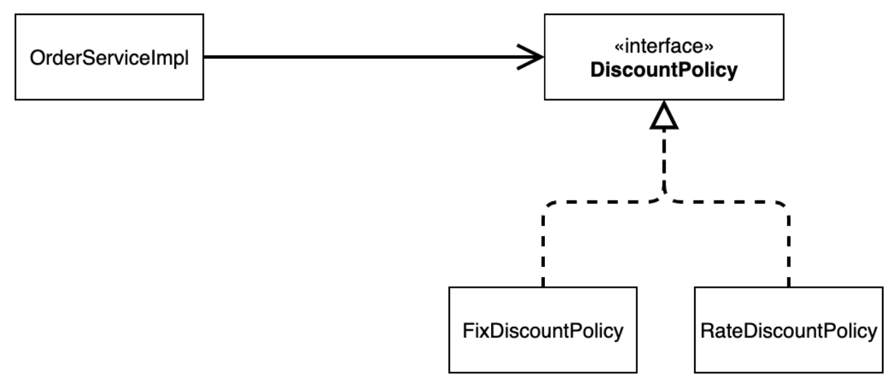

# 스프링 핵심 원리 이해2 - 객체 지향 원리 적용

Created date: 2024년 3월 1일 <br>
Last edited date: 2024년 3월 11일

<br>

# ✏️ 새로운 할인 정책 개발

### 새로운 할인 정책을 확장해보자

- 악덕 기획자: 서비스 오픈 직전에 할인 정책을 지금처럼 고정 금액 할인이 아니라 좀 더 합리적인 주문 금액당 할
인하는 정률% 할인으로 변경하고 싶어요. 예를 들어서 기존 정책은 VIP가 10000원을 주문하든 20000원을 주
문하든 항상 1000원을 할인했는데, 이번에 새로 나온 정책은 10%로 지정해두면 고객이 10000원 주문시 1000
원을 할인해주고, 20000원 주문시에 2000원을 할인해주는 거에요!
- 순진 개발자: 제가 처음부터 고정 금액 할인은 아니라고 했잖아요.
- 악덕 기획자: [애자일 소프트웨어 개발 선언](https://agilemanifesto.org/iso/ko/manifesto.html) 몰라요? “계획을 따르기보다 변화에 대응하기를”
- 순진 개발자: ... (하지만 난 유연한 설계가 가능하도록 객체지향 설계 원칙을 준수했지 후후)
- 우리가 정말 객체지향 설계 원칙을 잘 준수 했는지 확인해보자
- 주문한 금액의 %를 할인해주는 새로운 정률 할인 정책을 추가하자

### RateDiscountPolicy 추가



### RateDiscountPolicy 코드 추가

```java
package hello.core.discount;

import hello.core.member.Grade;
import hello.core.member.Member;

public class RateDiscountPolicy implements DiscountPolicy {

    private int discountPercent = 10;

    @Override
    public int discount(Member member, int price) {
        if (member.getGrade() == Grade.VIP) {
            return price * discountPercent / 100;
        } else {
            return 0;
        }
    }
}
```

### 테스트 작성

- 성공 테스트도 중요하지만 실패 테스트도 꼭 작성해야함

```java
package hello.core.discount;

import hello.core.member.Grade;
import hello.core.member.Member;
import org.assertj.core.api.Assertions;
import org.junit.jupiter.api.DisplayName;
import org.junit.jupiter.api.Test;

import static org.assertj.core.api.Assertions.*;
import static org.junit.jupiter.api.Assertions.*;

class RateDiscountPolicyTest {

    RateDiscountPolicy discountPolicy = new RateDiscountPolicy();

    @Test
    @DisplayName("VIP는 10% 할인이 적용되어야 한다.")
    void vip_o() {
        // given
        Member member = new Member(1L, "memberVIP", Grade.VIP);
        // when
        int discount = discountPolicy.discount(member, 10000);
        // then
        assertThat(discount).isEqualTo(1000);
    }

    @Test
    @DisplayName("VIP가 아니면 할인이 적용되지 않아야 한다.")
    void vip_x() {
        // given
        Member member = new Member(1L, "memberVIP", Grade.BASIC);
        // when
        int discount = discountPolicy.discount(member, 10000);
        // then
        assertThat(discount).isEqualTo(1000);
    }
}
```

<aside>

💡 **command + shift + t** <br>
테스트 하려는 메서드에 커서를 올리고 위의 단축키를 누르면 Create New Test 가능 <br>
**Assertions.assertThat의 static import** <br>
자주 쓰는 메서드이므로 option + enter 후 Add on-demand static import … 선택

</aside>

<br>

# ✏️ 새로운 할인 정책 적용과 문제점

## 새로운 할인 정책 적용

### OrderServiceImpl 수정

- 즉 클라이언트를 변경해야함

```java
package hello.core.order;

import hello.core.discount.DiscountPolicy;
import hello.core.discount.FixDiscountPolicy;
import hello.core.discount.RateDiscountPolicy;
import hello.core.member.Member;
import hello.core.member.MemberRepository;
import hello.core.member.MemoryMemberRepository;

public class OrderServiceImpl implements OrderService {

    private final MemberRepository memberRepository = new MemoryMemberRepository();
    //    private final DiscountPolicy discountPolicy = new FixDiscountPolicy();
    private final DiscountPolicy discountPolicy = new RateDiscountPolicy();
    @Override
    public Order createOrder(Long memberId, String itemName, int itemPrice) {
        Member member = memberRepository.findById(memberId);
        int discountPrice = discountPolicy.discount(member, itemPrice);

        return new Order(memberId, itemName, itemPrice, discountPrice);
    }
}
```

## 문제점

- 역할과 구현을 충실히 분리함 → OK
- 다형성도 활용해 인터페이스와 구현 객체를 분리함 → OK
- OCP, DIP 같은 객체 지향 설계 원칙을 충실히 수행함 → NO
    - 그렇게 보이지만 사실은 아님
- DIP: 주문 서비스 클라이언트(OrderServiceImpl)는 DiscountPolicy 인터페이스에 의존해 DIP를 지킨 것 같으나
    - 클래스 의존관계를 분석해보면 구체(구현) 클래스에도 의존하므로 DIP 위반
- OCP: 변경하지 않고 확장할 수 있다고 했는데
    - 지금의 코드는 기능을 확장해 변경하면 클라이언트 코드에 영향을 주므로 OCP 위반

### 기대했던 의존관계


### 실제 의존관계


### 정책 변경


## 어떻게 문제를 해결할 수 있나?

- 클라이언트 코드인 OrderServiceImpl은 DiscountPolicy의 인터페이스 뿐만 아니라 구체 클래스도 함께 의존
- 그래서 구체 클래스를 변경할 때 클라이언트 코드도 함께 변경해야 함
- DIP 위반 → 추상(인터페이스)에만 의존하도록 변경해야 함


### OrderServiceImpl 코드 변경

- 인터페이스에만 의존하도록 설계와 코드를 변경
- 하지만 구현체가 없는데 어떻게 코드를 실행할 수 있을까?
- 실제 실행을 해보면 NPE(null pointer exception)이 발생

```java
package hello.core.order;

import hello.core.discount.DiscountPolicy;
import hello.core.discount.FixDiscountPolicy;
import hello.core.discount.RateDiscountPolicy;
import hello.core.member.Member;
import hello.core.member.MemberRepository;
import hello.core.member.MemoryMemberRepository;

public class OrderServiceImpl implements OrderService {

    private final MemberRepository memberRepository = new MemoryMemberRepository();
    private DiscountPolicy discountPolicy;
    @Override
    public Order createOrder(Long memberId, String itemName, int itemPrice) {
        Member member = memberRepository.findById(memberId);
        int discountPrice = discountPolicy.discount(member, itemPrice);

        return new Order(memberId, itemName, itemPrice, discountPrice);
    }
}

```

### 해결방안

- 누군가가 클라이언트인 OrderServiceImpl에 DiscountPolicy의 구현 객체를 대신 생성하고 주입해주어야 함

<br>

# ✏️ 관심사의 분리

- 애플리케이션을 하나의 공연이라고 생각할 때, 각각의 인터페이스를 배역이라 생각한다면 실제 배역에 맞는 배우를 선택하는 것은 누가 하는가?
- 로미오와 줄리엣 공연을 하면 로미오 역할을 누가 할지 줄리엣 역할을 누가 할지는 배우들이 정하는 것이 아님
- 이전의 코드는 마치 로미오 역할(인터페이스)을 하는 레오나르도 디카프리오(구현체, 배우)가 줄리엣 역할(인터페이스)을 하는 여자 주인공(구현체, 배우)를 직접 초빙하는 것과 같음
- 이렇게 되면 디카프리오는 공연도 해야되고 여자 주인공도 공연에 **직접 초빙**해야 하는 다양한 책임을 가짐

### 관심사를 분리하자

- 배우(구현체)는 본인의 역할인 배역(인터페이스)을 수행하는 것에만 집중해야 함
- 디카프리오(구현체)는 어떤 여자 주인공(구현체)이 선택되더라도 똑같이 공연을 할 수 있어야 함
- 공연을 구성하고, 담당 배우를 섭외하고, 역할에 맞는 배우를 지정하는 책임을 담당하는 별도의 공연 기획자가 필요함
- 공연 기획자를 만들고, 배우와 공연 기획자의 책임을 확실히 분리하자
- 이것을 애플리케이션에 적용해 개발해보자

## AppConfig 등장

- 애플리케이션의 전체 동작 방식을 구성(Config)하기 위해, **구현 객체를 생성**하고, **연결**하는 책임을 가지는 별도의 설정 클래스를 만들자

### AppConfig

```java
package hello.core;

import hello.core.discount.FixDiscountPolicy;
import hello.core.member.MemberService;
import hello.core.member.MemberServiceImpl;
import hello.core.member.MemoryMemberRepository;
import hello.core.order.OrderService;
import hello.core.order.OrderServiceImpl;

public class AppConfig {

    public MemberService memberService() {
        return new MemberServiceImpl(new MemoryMemberRepository());
    }

    public OrderService orderService() {
        return new OrderServiceImpl(new MemoryMemberRepository(), new FixDiscountPolicy());
    }

}
```

- 애플리케이션의 실제 동작에 필요한 **구현 객체를 생성**
    - MemberServiceImpl
    - MemoryMemberRepository
    - OrderServiceImpl
    - FixDiscountPolicy
- 생성한 객체 인스턴스의 참조(레퍼런스)를 **생성자를 통해 주입(연결)**
    - MemberServiceImpl → MemoryMemberRepository
    - OrderServiceImpl → MemoryMemberRepository, FixDiscountPolicy

### MemberServiceImpl 생성자 주입

```java
package hello.core.member;

public class MemberServiceImpl implements MemberService {

    private final MemberRepository memberRepository;

    public MemberServiceImpl(MemberRepository memberRepository) {
        this.memberRepository = memberRepository;
    }

    @Override
    public void join(Member member) {
        memberRepository.save(member);
    }

    @Override
    public Member findMember(Long memberId) {
        return memberRepository.findById(memberId);
    }

}
```

- 더이상 MemoryMemberRepository를 의존하지 않음
- MemberRepository 인터페이스만 의존
- **의존 관계에 대한 고민은 외부(AppConfig)**에 맡기고 **실행에만 집중**

### 클래스 다이어그램


- 객체의 생성과 연결은 AppConfig가 담당
- DIP 완정: MemberServiceImpl은 MemberRepository인 추상에만 의존
- 관심사의 분리: 객체를 생성하고 연결하는 역할과 실행하는 역할이 명확히 분리

### 회원 객체 인스턴스 다이어그램


- appConfig 객체는 memoryMemberRepository 객체를 생성하고 그 참조값을 memberServiceImpl을 생성하며 생성자로 전달
- 클라이언트인 memberSeviceImple 입장에서 보면 의존관계를 마치 외부에서 주입해주는 것 같다고 해서 DI(Dependency Injection) 즉 의존관계 주입 또는 의존성 주입이라고 함

### OrderServiceImpl 생성자 주입

```java
package hello.core.order;

import hello.core.discount.DiscountPolicy;
import hello.core.discount.FixDiscountPolicy;
import hello.core.discount.RateDiscountPolicy;
import hello.core.member.Member;
import hello.core.member.MemberRepository;
import hello.core.member.MemoryMemberRepository;

public class OrderServiceImpl implements OrderService {

    private final MemberRepository memberRepository;
    private final DiscountPolicy discountPolicy;

    public OrderServiceImpl(MemberRepository memberRepository, DiscountPolicy discountPolicy) {
        this.memberRepository = memberRepository;
        this.discountPolicy = discountPolicy;
    }

    @Override
    public Order createOrder(Long memberId, String itemName, int itemPrice) {
        Member member = memberRepository.findById(memberId);
        int discountPrice = discountPolicy.discount(member, itemPrice);

        return new Order(memberId, itemName, itemPrice, discountPrice);
    }
}
```

- 더이상 MemoryMemberRepository와 FixDiscountPolicy를 의존하지 않음
- DiscountPolicy 인터페이스만 의존
- **의존 관계에 대한 고민은 외부(AppConfig)**에 맡기고 **실행에만 집중**

<aside>

💡 **command + [** <br>
뒤로가기 단축키로 인텔리제이에서는 이전에 보던 파일로 돌아갈 때 사용 <br>
**command + E** <br>
히스토리

</aside>

## AppConfig 실행

### MemberApp 수정

```java
package hello.core;

import hello.core.member.Grade;
import hello.core.member.Member;
import hello.core.member.MemberService;
import hello.core.member.MemberServiceImpl;

public class MemberApp {
    public static void main(String[] args) {
        AppConfig appConfig = new AppConfig();
        MemberService memberService = appConfig.memberService();
        Member member = new Member(1L, "memberA", Grade.VIP);
        memberService.join(member);

        Member findMember = memberService.findMember(1L);
        System.out.println("new Member = " + member.getName());
        System.out.println("find Member = " + findMember.getName());
    }
}
```

### OrderApp 수정

```java
package hello.core;

import hello.core.member.Grade;
import hello.core.member.Member;
import hello.core.member.MemberService;
import hello.core.member.MemberServiceImpl;
import hello.core.order.Order;
import hello.core.order.OrderService;
import hello.core.order.OrderServiceImpl;

public class OrderApp {

    public static void main(String[] args) {
        AppConfig appConfig = new AppConfig();
        MemberService memberService = appConfig.memberService();
        OrderService orderService = appConfig.orderService();

        Long memberId = 1L;
        Member member = new Member(memberId, "memberA", Grade.VIP);
        memberService.join(member);

        Order order = orderService.createOrder(memberId, "itemA", 10000);

        System.out.println("order = " + order);
    }
}
```

### MemberServiceTest 수정

```java
package hello.core.member;

import hello.core.AppConfig;
import org.assertj.core.api.Assertions;
import org.junit.jupiter.api.BeforeEach;
import org.junit.jupiter.api.Test;

public class MemberServiceTest {

    MemberService memberService;

    @BeforeEach
    public void beforeEach() {
        AppConfig appConfig = new AppConfig();
        memberService = appConfig.memberService();
    }

    @Test
    void join() {
        // given
        Member member = new Member(1L, "memberA", Grade.VIP);

        // when
        memberService.join(member);
        Member findMember = memberService.findMember(1L);

        // then
        Assertions.assertThat(member).isEqualTo(findMember);
    }
}
```

### OrderServiceTest 수정

```java
package hello.core.order;

import hello.core.AppConfig;
import hello.core.member.Grade;
import hello.core.member.Member;
import hello.core.member.MemberService;
import hello.core.member.MemberServiceImpl;
import org.assertj.core.api.Assertions;
import org.junit.jupiter.api.BeforeEach;
import org.junit.jupiter.api.Test;

public class OrderServiceTest {

    MemberService memberService;
    OrderService orderService;

    @BeforeEach
    public void beforeEach() {
        AppConfig appConfig = new AppConfig();
        memberService = appConfig.memberService();
        orderService = appConfig.orderService();
    }

    @Test
    void createOrder() {
        Long memberId = 1L;
        Member member = new Member(memberId, "memberA", Grade.VIP);
        memberService.join(member);

        Order order = orderService.createOrder(memberId, "itemA", 10000);
        Assertions.assertThat(order.getDiscountPrice()).isEqualTo(1000);
    }
}
```

<aside>

💡 **@BeforeEach** <br>
각 테스트를 실행하기 전에 호출

</aside>

## 정리

- AppConfig를 통해 관심사를 확실하게 분리
- 배역, 배우를 생각해보자
- AppConfig는 공연 기획자
- AppConfig는 구체 클래스를 선택, 배역에 맞는 담당 배우를 선택, 애플리케이션이 어떻게 동작해야 할지 전체 구성을 책임
- 각 배우들은 담당 기능을 실행하는 책임만 지면 됨
- OrderServiceImpl은 기능을 실행하는 책임만 지면 됨

<br>

# ✏️ AppConfig 리팩터링

- 현재의 AppConfig는 **중복**이 있고, **역할**에 따른 **구현**이 잘 안보임

### 기대하는 그림


- 현재는 이러한 역할들이 한눈에 보이지 않음

### 리팩터링 후

```java
package hello.core;

import hello.core.discount.DiscountPolicy;
import hello.core.discount.FixDiscountPolicy;
import hello.core.member.MemberRepository;
import hello.core.member.MemberService;
import hello.core.member.MemberServiceImpl;
import hello.core.member.MemoryMemberRepository;
import hello.core.order.OrderService;
import hello.core.order.OrderServiceImpl;

public class AppConfig {

    public MemberService memberService() {
        return new MemberServiceImpl(memberRepository());
    }

    private static MemberRepository memberRepository() {
        return new MemoryMemberRepository();
    }

    public OrderService orderService() {
        return new OrderServiceImpl(memberRepository(), discountPolicy());
    }

    private static DiscountPolicy discountPolicy() {
        return new FixDiscountPolicy();
    }

}
```

- new MemoryMemberRepository() 이 부분의 중복이 제거
    - 이제 MemoryMemberRepository를 다른 구현체로 변경 시 한 부분만 변경하면 됨
- AppConfig를 보면 역할과 구현 클래스가 한눈에 들어옴
- 애플리케이션 전체 구성이 어떻게 되어있는지 빠르게 파악 가능

<aside>

💡 **command + option + m** <br>
Extract Method

</aside>

<br>

# ✏️ 새로운 구조와 할인 정책 적용

- 처음으로 돌아가 정액 할인 정책을 정률 할인 정책으로 변경하자
- FixDiscountPolicy → RateDiscountPolicy
- AppConfig의 등장으로 애플리케이션이 크게 사용 영역과 객체를 생성하고 구성(Configuration)하는 영역으로 분리됨

### 사용, 구성의 분리


### 할인 정책의 변경


- FixDiscountPolicy → RateDiscountPolicy로 변경해도 구성 영역만 영향을 받고, 사용 영역은 전혀 영향을 받지 않음

### AppConfig 수정

```java
package hello.core;

import hello.core.discount.DiscountPolicy;
import hello.core.discount.FixDiscountPolicy;
import hello.core.discount.RateDiscountPolicy;
import hello.core.member.MemberRepository;
import hello.core.member.MemberService;
import hello.core.member.MemberServiceImpl;
import hello.core.member.MemoryMemberRepository;
import hello.core.order.OrderService;
import hello.core.order.OrderServiceImpl;

public class AppConfig {

    public MemberService memberService() {
        return new MemberServiceImpl(memberRepository());
    }

    private static MemberRepository memberRepository() {
        return new MemoryMemberRepository();
    }

    public OrderService orderService() {
        return new OrderServiceImpl(memberRepository(), discountPolicy());
    }

    private static DiscountPolicy discountPolicy() {
        return new RateDiscountPolicy();
    }

}
```

- 이제 할인 정책을 변경해도 애플리케이션의 구성 역할을 담당하는 AppConfig만 변경하면 됨
- 클라이언트 코드인 OrderServiceImpl을 포함해 **사용 영역**의 그 어떤 코드도 변경할 필요 없음
- **구성 영역**은 당연히 변경됨
- 구성 역할을 담당하는 AppConfig를 애플리케이션이라는 공연의 기획자로 생각하면 공연 기획자는 공연 참여자인 구현 객체들을 모두 알아야 함

<br>

# ✏️ 전체 흐름 정리

- 새로운 할인 정책 개발
- 새로운 할인 정책 적용과 문제점
- 관심사의 분리
- AppConfig 리팩터링
- 새로운 구조와 할인 정책 적용

## 새로운 할인 정책 개발

다형성 덕분에 새로운 정률 할인 정책 코드를 추가로 개발하는 것 자체는 아무 문제가 없음

## 새로운 할인 정책 적용과 문제점

새로 개발한 정률 할인 정책을 정용하려고 하니 클라이언트 코드인 주문 서비스 구현체를 함께 변경해야함

주문 서비스 클라이언트가 인터페이스인 DiscountPolicy뿐만 아니라, 구체 클래스인 FixDiscountPolicy도 함께 의존 → **DIP 위반**

## 관심사의 분리

애플리케이션의 전체 동작 방식을 구성하기 위해 구현 객체를 생성하고 연결하는 책임을 지는 AppConfig가 등장

## AppConfig 리팩터링

구성 정보에서 역할과 구현을 명확하게 분리하고 중복을 제거했더니 역할이 잘 드러남

## 새로운 구조와 할인 정책 적용

정액 할인 정책에서 정률 할인 정책으로 변경

AppConfig의 등장으로 애플리케이션이 크게 **사용 영역**과 객체를 생성하고 **구성하는 영역**으로 분리됨

때문에 할인 정책을 변경해도 AppConfig가 있는 구성 영역만 변경하면 됨

# ✏️ 좋은 객체 지향 설계의 5가지 원칙의 적용

여기서 3가지 SRP, DIP, OCP 적용

## SRP 단일 책임 원칙

한 클래스는 하나의 책임만 가져야 한다

- 클라이언트 객체는 직접 구현 객체를 생성하고, 연결하고, 실행하는 다양한 책임을 가지고 있음
- SRP 단일 책임 원칙을 따르며 관심사를 분리
- 구현 객체를 생성하고 연결하는 책임은 AppConfig가 담당
- 클라이언트 객체는 실행하는 책임만 담당

## DIP 의존관계 역전 원칙

프로그래머는 추상화에 의존해야지 주체화에 의존하면 안된다 의존성 주입은 이 원칙을 따르는 방법 중 하나다

- 새로운 할인 정책을 개발하고 적용하려고 하니 클라이언트 코드도 함께 변경해야 함
- 왜냐하면 기존의 클라이언트 코드는 DIP를 지키며 DiscountPolicy 추상화 인터페이스에 의존하는 것 같았지만 사실 FixDiscountPolicy 구체화 구현 클래스에도 함께 의존했기 때문에
- 클라이언트 코드가 DiscountPolicy 추상화 인터페이스에만 의존하도록 코드를 변경
- 하지만 클라이언트 코드는 인터페이스만으로는 아무것도 실행할 수 없음
- AppConfig가 FixDiscountPolicy 객체 인스턴스를 클라이언트 코드 대신 생성해 클라이언트 코드에 의존관계를 주입함
- 이렇게해서 DIP 원칙을 따르며 문제를 해결

## OCP

소프트웨어 요소는 확장에는 열려 있으나 변경에는 닫혀 있어야 한다

- 다형성을 사용하고 클라이언트가 DIP를 지킴
- 애플리케이션을 사용 영역과 구성 영역으로 나눔
- AppConfig가 의존 관계를 FixDiscountPolicy에서 RateDiscountPolicy로 변경해서 클라이언트 코드에 주입하므로 클라이언트 코드는 변경하지 않아도 됨
- 소프트웨어 요소를 새롭게 확장해도 사용 영역의 변경은 닫혀있다!
    - 확장해도 변경할 필요가 없다!

<br>

# ✏️ IoC, DI, 그리고 컨테이너

## 제어의 역전 IoC(Inversion of Control)

- 기존의 프로그램은 클라이언트 구현 객체가 스스로 필요한 서버 구현 객체를 생성하고, 연결하고, 실행함
- 즉 구현 객체가 프로그램의 제어 흐름을 스스로 조절함 이는 개발자 입장에서는 자연스러운 흐름
- 하지만 AppConfig가 등장한 이후 구현 객체는 자신의 로직을 실행하는 역할만 담당
- 프로그램의 제어 흐름은 이제 AppConfig가 가져감
    - 즉 OrderServiceImpl은 필요한 인터페이스들을 호출하지만 어떤 구현 객체들이 실행될지는 모름
- 프로그램에 대한 제어 흐름에 대한 권한은 모두 AppConfig가 가지고 있음
- 심지어 OrderServiceImpl도 AppConfig가 생성하며 OrderService 인터페이스의 다른 구현 객체를 생성하고 실행할 수도 있음
- 이렇듯 프로그램의 제어 흐름을 직접 제어하는 것이 아니라 외부에서 관리하는 것을 제어의 역전(IoC)라고 함

### 프레임워크 vs 라이브러리

- 프레임워크가 내가 작성한 코드를 제어하고, 대신 실행하면 그것은 프레임워크가 맞음(JUnit)
- 반면 내가 작성한 코드가 직접 제어의 흐름을 담당하면 그것은 프레임워크가 아니라 라이브러리

## 의존 관계 주입 DI(Dependency Injection)

- OrderServiceImpl은 DiscountPolicy 인터페이스에 의존
- 실제 어떤 구현 객체가 사용될지는 모름
- 의존관계는 **정적인 클래스 의존 관계**와 **실행 시점에 결정되는 동적인 객체(인스턴스) 의존 관계** 둘을 분리해서 생각해야함

### 정적인 클래스 의존관계

- 클래스가 사용하는 import 코드만 보고 의존관계를 쉽게 판단 가능
- 정적인 의존관계는 애플리케이션을 실행하지 않아도 분석 가능
- 아래 클래스 다이어그램을 보면 OrderServiceImpl은 MemberRepository와 DiscountPolicy에 의존한다는 것을 알 수 있음
- 하지만 이러한 클래스 의존관계 만으로는 실제 어떤 객체가 OrderServiceImpl에 주입 될지 알 수 없음

### 클래스 다이어그램


### 동적인 객체 인스턴스 의존 관계

- 애플리케이션 실행 시점에 실제 생성된 객체 인스턴스의 참조가 연결된 의존 관계

### 객체 다이어그램


- 애플리케이션 실행 시점(런타임)에 외부에서 실제 구현 객체를 생성하고 클라이언트에 전달해 클라이언트와 서버의 실제 의존관계가 연결되는 것을 의존관계 주입이라함
- 객체 인스턴스를 생성하고 그 참조값을 전달해서 연결
- 의존관계 주입을 사용하면 클라이언트 코드를 변경하지 않고, 클라이언트가 호출하는 대상의 타입 인스턴스를 변경할 수 있음
- 의존관계 주입을 사용하면 정적인 클래스 의존관계를 변경하지 않고, 동적인 객체 인스턴스 의존관계를 쉽게 변경 가능

## IoC 컨테이너, DI 컨테이너

- AppConfig 처럼 객체를 생성하고 관리하며 의존관계를 연결해 주는 것을
- IoC 컨테이너 또는 **DI 컨테이너**라 함
- 의존관계 주입에 초점을 맞추어 최근에는 주로 DI 컨테이너라 함
- 또는 어샘블러, 오브젝트 팩토리 등으로 불리기도 함

<br>

# ✏️ 스프링으로 전환하기

지금까지는 순수한 자바 코드만으로 DI를 적용함

이제는 스프링을 사용해보자

### AppConfig 스프링 기반으로 변경

```java
package hello.core;

import hello.core.discount.DiscountPolicy;
import hello.core.discount.FixDiscountPolicy;
import hello.core.discount.RateDiscountPolicy;
import hello.core.member.MemberRepository;
import hello.core.member.MemberService;
import hello.core.member.MemberServiceImpl;
import hello.core.member.MemoryMemberRepository;
import hello.core.order.OrderService;
import hello.core.order.OrderServiceImpl;
import org.springframework.context.annotation.Bean;
import org.springframework.context.annotation.Configuration;

@Configuration
public class AppConfig {

    @Bean
    public MemberService memberService() {
        return new MemberServiceImpl(memberRepository());
    }

    @Bean
    public static MemberRepository memberRepository() {
        return new MemoryMemberRepository();
    }

    @Bean
    public OrderService orderService() {
        return new OrderServiceImpl(memberRepository(), discountPolicy());
    }

    @Bean
    public static DiscountPolicy discountPolicy() {
        return new RateDiscountPolicy();
    }

}
```

- AppConfig에 설정을 구성한다는 뜻의 @Configuration을 붙임
- 각 메서드에 @Bean을 붙임
    - 이렇게 하면 스프링 컨테이너에 스프링 빈으로 등록

<aside>

💡 **option + command + v** <br>
좌항 자동완성 <br>
**command + e → enter** <br>
이전 파일로 돌아가기 <br>

</aside>

### MemberApp에 스프링 컨테이너 적용

```java
package hello.core;

import hello.core.member.Grade;
import hello.core.member.Member;
import hello.core.member.MemberService;
import hello.core.member.MemberServiceImpl;
import org.springframework.context.ApplicationContext;
import org.springframework.context.annotation.AnnotationConfigApplicationContext;

public class MemberApp {
    public static void main(String[] args) {
//        AppConfig appConfig = new AppConfig();
//        MemberService memberService = appConfig.memberService();

        ApplicationContext applicationContext = new AnnotationConfigApplicationContext(AppConfig.class);
        MemberService memberService = applicationContext.getBean("memberService", MemberService.class);

        Member member = new Member(1L, "memberA", Grade.VIP);
        memberService.join(member);

        Member findMember = memberService.findMember(1L);
        System.out.println("new Member = " + member.getName());
        System.out.println("find Member = " + findMember.getName());
    }
}
```

### OrderApp에 스프링 컨테이너 적용

```java
package hello.core;

import hello.core.member.Grade;
import hello.core.member.Member;
import hello.core.member.MemberService;
import hello.core.member.MemberServiceImpl;
import hello.core.order.Order;
import hello.core.order.OrderService;
import hello.core.order.OrderServiceImpl;
import org.springframework.context.ApplicationContext;
import org.springframework.context.annotation.AnnotationConfigApplicationContext;

public class OrderApp {

    public static void main(String[] args) {
//        AppConfig appConfig = new AppConfig();
//        MemberService memberService = appConfig.memberService();
//        OrderService orderService = appConfig.orderService();

        ApplicationContext applicationContext = new AnnotationConfigApplicationContext(AppConfig.class);
        MemberService memberService = applicationContext.getBean("memberService", MemberService.class);
        OrderService orderService = applicationContext.getBean("orderService", OrderService.class);

        Long memberId = 1L;
        Member member = new Member(memberId, "memberA", Grade.VIP);
        memberService.join(member);

        Order order = orderService.createOrder(memberId, "itemA", 20000);

        System.out.println("order = " + order);
    }
}
```

위의 두 코드를 실행하면 스프링 관련 로그가 몇 줄 실행(이건 잘.. 모르겠음)되며 기존과 동일한 결과가 출력됨

## 스프링 컨테이너

- ApplicationContext를 스프링 컨테이너라 함
- 기존에는 개발자가 AppConfig를 사용해 직접 객체를 생성하고 DI 했지만 이제부터는 스프링 컨테이너를 통해 사용
- 스프링 컨테이너는 @Configuration이 붙은 AppConfig를 설정(구성) 정보로 사용
- 여기서 @Bean이라 적신 메서드를 모두 호출해 반환된 객체를 스프링 컨테이너에 등록
- 이렇게 스프링 컨테이너에 등록된 객체를 스프링 빈이라 함
- 스프링 빈은 @Bean이 붙은 메서드의 명을 스프링 빈의 이름으로 사용(memberService, orderService)
- 이전에는 개발자가 필요한 객체를 AppConfig를 사용해 직접 조회했지만, 이제부터는 스프링 컨테이너를 통해 필요한 스프링 빈(객체)를 찾아야함
- 스프링 빈은 applicationContext.getBean() 메서드를 사용해 찾을 수 있음
- 기존에는 개발자가 직접 자바코드로 모든 것을 했다면 이제부터는 스프링 컨테이너에 객체를 스프링 빈으로 등록하고, 스프링 컨테이너에서 스프링 빈을 찾아 사용하도록 변경

→ 그런데 코드가 좀 더 복잡해진 것 같다 스프링 컨테이너를 사용하면 어떤 장점이 있을까?

장점은 어마어마하게 많다네요….