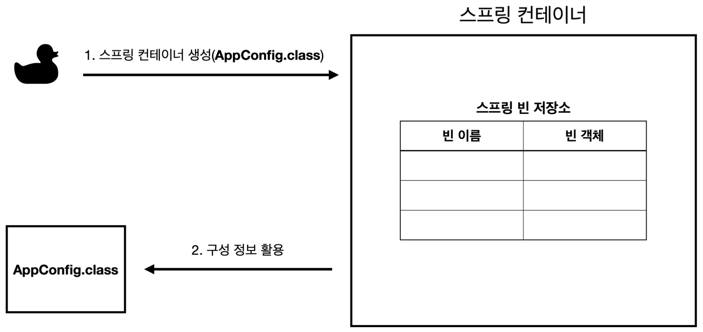

# 스프링 컨테이너와 스프링 빈

Created date: 2024년 3월 17일

<br>

# ✏️ 스프링 컨테이너 생성

스프링 컨테이너는 다음과 같이 생성

```java
//스프링 컨테이너 생성
ApplicationContext applicationContext =
                     new AnnotationConfigApplicationContext(AppConfig.class);
```

- ApplicationContext를 스프링 컨테이너라고 함
- ApplicationContext는 인터페이스
- 스프링 컨테이너는 XML을 기반으로 만들 수 있고, 애노테이션 기반의 자바 설정 클래스로 만들 수 있음
    - 최근에는 애노테이션 기반으로 많이 생성
- 자바 설정 클래스를 기반으로 스프링 컨테이너를 만들어보자
    - new AnnotaionConfigApplicationContext(AppConfig.class);
    - 이 클래스를 ApplicationContext 인터페이스의 구현체
- 참고
    - 더 정확히는 스프링 컨테니러르 부를 때 BeanFactory와 ApplicationContext로 구분해서 이야기 함
    - 하지만 BeanFactory를 직접 사용하는 경우는 거의 없으므로 ApplicationContext를 보통 스프링 컨테이너라 함

## 스프링 컨테이너의 생성 과정

### 1. 스프링 컨테이너 생성



- new AnnotationConfigApplicationContext(AppConfig.class)
- 스프링 컨테이너 생성 시 구성 정보를 지정해 주어야 함
- 여기서는 AppConfig.class를 구성 정보로 지정

### 2. 스프링 빈 등록


- 스프링 컨테이너는 파라미터로 넘어온 설정 클래스 정보를 사용해 스프링 빈을 등록
- 빈 이름은
    - 메서드 이름을 사용
    - 직접 부여할 수 있음
        - @Bean(name=”memberService2”)
    - 항상 다른 이름을 부여해야함

### 3. 스프링 빈 의존관계 설정 - 준비


### 4. 스프링 빈 의존관계 설정 - 완료


- 스프링 컨테이너는 설정 정보를 참고해 의존관계를 주입(DI)
- 단순히 자바 코드를 호출하는 것 같지만, 차이가 있음
    - 이 차이는 이후 싱글톤 컨테이너에서 설명

### 참고

- 스프링은 빈을 생성하고, 의존관계를 주입하는 단계가 나누어져 있음
- 그런데 이렇게 자바 코드로 스프링 빈을 등록하면 생성자를 호출하며 의존관계 주입도 한번에 처리
- 여기서는 이해를 돕기 위해 개념적으로 나누어 설명함
- 자세한 내용은 의존관계 자동 주입에서 다시 설명

### 정리

- 스프링 컨테이너를 생성하고
- 설정(구성) 정보를 참고해 스프링 빈을 등록하고
- 의존관계도 설정함
- 이제 스프링 컨테이너에서 데이터를 조회해보자

<br>

# ✏️ 컨테이너에 등록된 모든 빈 조회

```java
package hello.core.beanfind;

import hello.core.AppConfig;
import org.junit.jupiter.api.DisplayName;
import org.junit.jupiter.api.Test;
import org.springframework.beans.factory.config.BeanDefinition;
import org.springframework.context.annotation.AnnotationConfigApplicationContext;

public class ApplicationContextInfoText {

    AnnotationConfigApplicationContext ac = new AnnotationConfigApplicationContext(AppConfig.class);

    @Test
    @DisplayName("모든 빈 출력하기")
    void findAllBean() {
        String[] beanDefinitionNames = ac.getBeanDefinitionNames();
        for (String beanDefinitionName : beanDefinitionNames) {
            Object bean = ac.getBean(beanDefinitionName);
            System.out.println("name = " + beanDefinitionName + " object = " + bean);
        }
    }
    @Test
    @DisplayName("애플리케이션 빈 출력하기")
    void findApplicationBean() {
        String[] beanDefinitionNames = ac.getBeanDefinitionNames();
        for (String beanDefinitionName : beanDefinitionNames) {
            BeanDefinition beanDefinition = ac.getBeanDefinition(beanDefinitionName);

            // 내가 애플리케이션을 위해 직접 등록한 빈이라면 출력
            // Role ROLE_APPLICATION: 직접 등록한 애플리케이션 빈
            // Role ROLE_INFRASTRUCTURE: 스프링이 내부에서 사용하는 빈
            if (beanDefinition.getRole() == BeanDefinition.ROLE_APPLICATION) {
                Object bean = ac.getBean(beanDefinitionName);
                System.out.println("name = " + beanDefinitionName + " object = " + bean);
            }
        }
    }

}
```

- 모든 빈 출력하기
    - 실행 시 스프링에 등록된 모든 빈 정보를 출력
- 애플리케이션 빈 출력하기
    - 스프링이 내부에서 사용하는 빈은 제외하고, 내가 등록한 빈만 출력
    - Role ROLE_APPLICATION: 직접 등록한 애플리케이션 빈
    - Role ROLE_INFRASTRUCTURE: 스프링이 내부에서 사용하는 빈

<aside>

💡 **iter + tap** <br>
리스트나 배열이 있을 때 위의 단축키를 눌러주면 for문이 알아서 생성

</aside>

# ✏️ 스프링 빈 조회 - 기본

- ac.getBean(빈이름, 타입)
- ac.getBean(타입)
- 조회 대상 스프링 빈이 없으면 예외 발생
    - NoSuchBeanDefinitionException: No bean named ‘xxxxx’ available

### 예제 코드

```java
package hello.core.beanfind;

import hello.core.AppConfig;
import hello.core.member.MemberService;
import hello.core.member.MemberServiceImpl;
import org.assertj.core.api.Assertions;
import org.junit.jupiter.api.DisplayName;
import org.junit.jupiter.api.Test;
import org.springframework.beans.factory.NoSuchBeanDefinitionException;
import org.springframework.context.annotation.AnnotationConfigApplicationContext;

import static org.assertj.core.api.Assertions.*;
import static org.junit.jupiter.api.Assertions.*;

public class ApplicationContextBasicFindTest {

    AnnotationConfigApplicationContext ac = new AnnotationConfigApplicationContext(AppConfig.class);

    @Test
    @DisplayName("빈 이름으로 조회")
    void findByNema() {
        MemberService memberService = ac.getBean("memberService", MemberService.class);
        assertThat(memberService).isInstanceOf(MemberServiceImpl.class);
    }
    @Test
    @DisplayName("이름 없이 타입으로만 조회")
    void findByType() {
        MemberService memberService = ac.getBean(MemberService.class);
        assertThat(memberService).isInstanceOf(MemberServiceImpl.class);
    }
    @Test
    @DisplayName("구체 타입으로 조회")
    void findByNema2() {
        MemberService memberService = ac.getBean("memberService", MemberServiceImpl.class);
        assertThat(memberService).isInstanceOf(MemberServiceImpl.class);
    }
    @Test
    @DisplayName("빈 이름으로 조회x")
    void findByNemaX() {
        // ac.getBean("xxxxx", MemberService.class);
        assertThrows(NoSuchBeanDefinitionException.class,
                () -> ac.getBean("xxxx", MemberService.class));
    }

}
```

- 구체 타입으로 조회하는 것은 사실 역할이 아닌 구현에 의존하는 것이므로 좋진 않음
- assertThrows: junit의 메서드로 어떤 메서드를 실행했을 때 어떤 예외가 터져야 test 통과

<br>

# ✏️ 스프링 빈 조회 - 동일한 타입이 둘 이상

- 타입으로 조회 시 같은 타입의 스프링 빈이 둘 이상이면 오류가 발생
- 이때는 빈 이름을 지정
- ac.getBeansOfType()을 사용하면 해당 타입의 모든 빈을 조회 가능

```java
package hello.core.beanfind;

import hello.core.AppConfig;
import hello.core.discount.DiscountPolicy;
import hello.core.member.MemberRepository;
import hello.core.member.MemoryMemberRepository;
import org.junit.jupiter.api.Assertions;
import org.junit.jupiter.api.DisplayName;
import org.junit.jupiter.api.Test;
import org.springframework.beans.factory.NoUniqueBeanDefinitionException;
import org.springframework.context.annotation.AnnotationConfigApplicationContext;
import org.springframework.context.annotation.Bean;
import org.springframework.context.annotation.Configuration;

import java.util.Map;

import static org.assertj.core.api.Assertions.*;

public class ApplicationContextSameBeanFindTest {

    AnnotationConfigApplicationContext ac = new AnnotationConfigApplicationContext(SameBeanConfig.class);

    @Test
    @DisplayName("타입으로 조회 시 같은 타입이 둘 이상 있으면, 중복 오류가 발생")
    void findBeanByTypeDuplicate() {
        Assertions.assertThrows(NoUniqueBeanDefinitionException.class,
                () -> ac.getBean(MemberRepository.class));
    }
    @Test
    @DisplayName("타입으로 조회 시 같은 타입이 둘 이상 있으면, 빈 이름을 지정")
    void findBeanByName() {
        MemberRepository memberRepository = ac.getBean("memberRepository1", MemberRepository.class);
        assertThat(memberRepository).isInstanceOf(MemberRepository.class);
    }
    @Test
    @DisplayName("특정 타입을 모두 조회")
    void findAllBeanByType() {
        Map<String, MemberRepository> beansOfType = ac.getBeansOfType(MemberRepository.class);
        for (String key : beansOfType.keySet()) {
            System.out.println("key = " + key + " value = " + beansOfType.get(key));
        }
        System.out.println("beansOfType = " + beansOfType);
        assertThat(beansOfType.size()).isEqualTo(2);
    }

    @Configuration
    static class SameBeanConfig {

        @Bean
        public MemberRepository memberRepository1() {
            return new MemoryMemberRepository();
        }

        @Bean
        public MemberRepository memberRepository2() {
            return new MemoryMemberRepository();
        }
    }
}
```

<br>

# ✏️ 스프링 빈 조회 - 상속관계

- 부모 타입으로 조회하면 자식 타입도 함께 조회됨
- 그래서 모든 자바 객체의 최고 부모인 Object 타입으로 조회하면 모든 스프링 빈을 조회

```java
package hello.core.beanfind;

import hello.core.discount.DiscountPolicy;
import hello.core.discount.FixDiscountPolicy;
import hello.core.discount.RateDiscountPolicy;
import org.junit.jupiter.api.Assertions;
import org.junit.jupiter.api.DisplayName;
import org.junit.jupiter.api.Test;
import org.springframework.beans.factory.NoUniqueBeanDefinitionException;
import org.springframework.context.annotation.AnnotationConfigApplicationContext;
import org.springframework.context.annotation.Bean;
import org.springframework.context.annotation.Configuration;

import java.util.Map;

import static org.assertj.core.api.Assertions.*;
import static org.junit.jupiter.api.Assertions.*;

public class ApplicationContextExtendsFindTest {

    AnnotationConfigApplicationContext ac = new AnnotationConfigApplicationContext(TestConfig.class);

    @Test
    @DisplayName("부모 타입으로 조회 시, 자식이 둘 이상 있으면 중복 오류가 발생")
    void findBeanByParentTypeDuplicate() {
        assertThrows(NoUniqueBeanDefinitionException.class,
                () -> ac.getBean(DiscountPolicy.class));
    }

    @Test
    @DisplayName("부모 타입으로 조회 시, 자식이 둘 이상 있으면 빈 이름을 지정")
    void findBeanByParentTypeBeanName() {
        DiscountPolicy rateDiscountPolicy = ac.getBean("rateDiscountPolicy", DiscountPolicy.class);
        assertThat(rateDiscountPolicy).isInstanceOf(RateDiscountPolicy.class);
    }

    @Test
    @DisplayName("특정 하위 타입으로 조회")
    void findBeanBySubType() {
        RateDiscountPolicy bean = ac.getBean(RateDiscountPolicy.class);
        assertThat(bean).isInstanceOf(RateDiscountPolicy.class);
    }

    @Test
    @DisplayName("부모 타입으로 모두 조회")
    void findAllBeanByParentType() {
        Map<String, DiscountPolicy> beansOfType = ac.getBeansOfType(DiscountPolicy.class);
        assertThat(beansOfType.size()).isEqualTo(2);
        for (String key : beansOfType.keySet()) {
            System.out.println("key = " + key + " value = " + beansOfType.get(key));
        }
    }

    @Test
    @DisplayName("부모 타입으로 모두 조회하기 - Object")
    void findAllBeanByObjectType() {
        Map<String, Object> beansOfType = ac.getBeansOfType(Object.class);
        for (String key : beansOfType.keySet()) {
            System.out.println("key = " + key + " value = " + beansOfType.get(key));
        }
    }

    @Configuration
    static class TestConfig {

        @Bean
        public DiscountPolicy rateDiscountPolicy() {
            return new RateDiscountPolicy();
        }

        @Bean
        public DiscountPolicy fixDiscountPolicy() {
            return new FixDiscountPolicy();
        }
    }
}
```

<br>

# ✏️ BeanFactory와 ApplicationContext


## BeanFactory

- 스프링 컨테이너의 최상위 인터페이스
- 스프링 빈을 관리하고 조회하는 역할
- getBean()을 제공
- 지금까지 우리가 사용한 대부분의 기능은 BeanFactory가 제공하는 기능

## ApplicationContext

- BeanFactory의 기능을 모두 상속받아 제공
- 빈을 관리하고 검색하는 기능은 BeanFactory가 제공하는데, 둘의 차이가 뭘까?
- 애플리케이션을 개발할 때는 빈을 관리하고 조회하는 기능은 물론이고, 수많은 부가 기능이 필요

### ApplicationContext가 제공하는 부가기능


- 메세지소스를 활용한 국제화 기능
    - 예를 들어 한국에서 들어오면 한국어로, 영어권에서 들어오면 영어로 출력
- 환경변수
    - 로컬, 개발, 운영 등을 구분해 처리
- 애플리케이션 이벤트
    - 이벤트를 발행하고 구독하는 모델을 편리하게 지원
- 편리한 리소스 조회
    - 파일, 클래스패스, 외부 등에서 리소스를 편리하게 조회

## 정리

- ApplicationContext는 BeanFactory의 기능을 상속받음
- ApplicationContext는 빈 관리기능과 함께 편리한 부가 기능을 제공
- BeanFactory를 직접 사용할 일은 거의 없음
- 부가기능이 포함된 ApplicationContext를 사용
- BeanFatory나 ApplicationContext를 스프링 컨테이너라 함

<br>

# ✏️ 다양한 설정 형식 지원 - 자바 코드, XML

- 스프링 컨테이너는 다양한 형식의 설정 정보를 받아들일 수 있도록 유연하게 설계됨
    - 자바 코드, XML, Groovy 등


## 애노테이션 기반 자바 코드 설정 사용

- 지금까지 했던 것
- new AnnotationConfigApplicationContext(AppConfig.class)
- AnnotationConfigApplicationContext 클래스를 사용해 자바 코드로 된 설정 정보를 넘김

## XML 설정 사용

- 최근에는 스프링 부트를 많이 사용하며 이는 잘 사용하지 않음
- 아직 많은 레거시 프로젝트들이 XML로 되어있고, XML을 사용하면 컴파일 없이 빈 설정 정보를 변경할 수 있는 장점도 있으므로 한번쯤 배워두는 것도 괜찮음
- GenericXmlApplicationContext를 사용하며 xml 설정 파일을 넘기면 됨
- 부캠에서 쓴 방법인듯

<br>

# ✏️ 스프링 빈 설정 메타 정보 - BeanDefinition

그냥 그런갑다.. 하고 편하게 들어도 됨

- 스프링은 어떻게 이런 다양한 형식을 지원할까?
- 그 중심에는 BeanDefinition이라는 추상화가 있음
- 쉽게 이야기해 역할과 구현을 개념적으로 나눈 것
    - XML을 읽어 BeanDefinition을 만듬
    - 자바 코드를 읽어 BeanDefinition을 만듬
    - 스프링 컨테이너는 자바 코드인지, XML인지 몰라도 됨 오직 BeanDefinition만 알면 됨
- BeanDefinition을 빈 설정 메타 정보라 함
    - @Bean, <bean> 당 각각 하나씩 메타 정보가 생성
- 스프링 컨테이너는 이 메타정보를 기반으로 스프링 빈을 생성


- 코드 레벨로 조금 더 깊이 있게 들어가면


- AnnotationConfigApplicationContext는 AnnotatedBeanDefinitionReader를 사용해 AppConfig.class를 읽고 BeanDefinition을 생성
- GenericXmlApplicationContext는 XmlBeanDefinitionReader를 사용해 appConfig.xml 설정 정보를 읽고 BeanDefinition을 생성
- 새로운 형식의 설정 정보가 추가되면 XxxBeanDefinitionReader를 만들어 BeanDefinition을 생성하면 됨

## BeanDefinition 살펴보기

- BeanClassName: 생성할 빈의 클래스 명(자바 설정 처럼 팩토리 역할의 빈을 사용하면 없음)
- factoryBeanName: 팩토리 역할의 빈을 사용할 경우 이름, 예) appConfig
- factoryMethodName: 빈을 생성할 팩토리 메서드 지정, 예) memberService
- Scope: 싱글톤(기본값)
- lazyInit: 스프링 컨테이너를 생성할 때 빈을 생성하는 것이 아니라, 실제 빈을 사용할 때 까지 최대한 생성을 지연처리 하는지 여부
- InitMethodName: 빈을 생성하고, 의존관계를 적용한 뒤에 호출되는 초기화 메서드 명
- DestroyMethodName: 빈의 생명주기가 끝나서 제거하기 직전에 호출되는 메서드 명
- Constructor arguments, Properties: 의존관계 주입에서 사용한다. (자바 설정 처럼 팩토리 역할의 빈을 사용하면 없음)

```java
package hello.core.beandefinition;
import hello.core.AppConfig;
import org.junit.jupiter.api.DisplayName;
import org.junit.jupiter.api.Test;
import org.springframework.beans.MutablePropertyValues;
import org.springframework.beans.factory.config.BeanDefinition;
import org.springframework.beans.factory.config.ConstructorArgumentValues;
import
org.springframework.context.annotation.AnnotationConfigApplicationContext;
import org.springframework.context.support.GenericXmlApplicationContext;
public class BeanDefinitionTest {
    AnnotationConfigApplicationContext ac = new
AnnotationConfigApplicationContext(AppConfig.class);
//    GenericXmlApplicationContext ac = new
GenericXmlApplicationContext("appConfig.xml");
@Test
@DisplayName("빈 설정 메타정보 확인") void findApplicationBean() {
        String[] beanDefinitionNames = ac.getBeanDefinitionNames();
        for (String beanDefinitionName : beanDefinitionNames) {
            BeanDefinition beanDefinition =
ac.getBeanDefinition(beanDefinitionName);
            if (beanDefinition.getRole() == BeanDefinition.ROLE_APPLICATION) {
                System.out.println("beanDefinitionName" + beanDefinitionName +
						} 
				}
		} 
}
```

## 정리

- BeanDefinition을 직접 생성해 스프링 컨테이너에 등록할 수도 있음
- 하지만 실무에서 BeanDefinition을 직접 정의하거나 사용할 일은 거의 없음
- BeanDefinition에 대해서는 너무 깊이있게 이해하기 보다는, 스프링이 다양한 형태의 설정 정보를 BeanDefinition으로 추상화해 사용한다는 것 정도만 이해
- 가끔 스프링 코드나 스프링 관련 오픈 소스의 코드를 볼 때, BeanDefinition이라는 것이 보일 때가 있음 이 때 이런 메커니즘을 떠올리면 됨