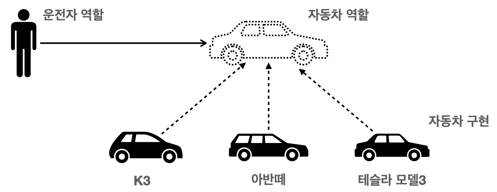
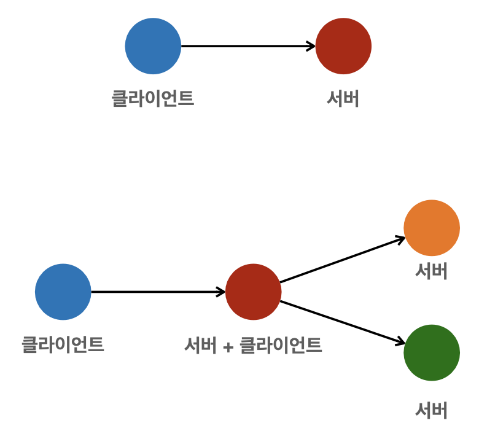
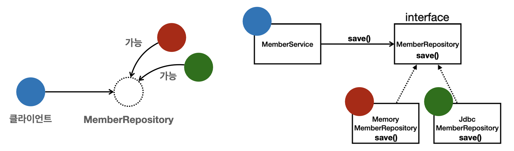

# 객체 지향 설계와 스프링

Created date: 2024년 2월 28일

<br>

# ✏️ 스프링이란?

## 스프링 생태계

- 스프링이란 여려가지 기술들의 모음
    - 가장 핵심이 되는 스프링 프레임워크
    - 다양한 기술들을 편리하게 사용할 수 있게 해주는 스프링 부트
    - 스프링 데이터, 스프링 세션, 스프링 시큐리티, 스프링 Rest Docs, 스프링 배치, 스프링 클라우드
    - 이 외에도 [spring.io](http://spring.io)에 들어가 Project Overview를 보면 다양한 기술이 존재

### 스프링 프레임워크

- 핵심 기술: 스프링 DI 컨테이너, AOP, 이벤트, 기타
- 웹 기술: 스프링 MVC, 스프링 WebFlux
- 데이터 접근 기술: 트랜잭션, JDBC, ORM 지원, XML 지원
- 기술 통합: 캐시, 이메일, 원격 접근, 스케줄링
- 테스트: 스프링 기반 테스트 지원
- 언어: 코틀린, 그루비
- 최근에는 스프링 부트를 통해 스프링 프레임워크의 기술들을 편리하게 사용

### 스프링 부트

- 스프링을 편히라게 사용할 수 있도록 지원, 최근에는 기본으로 사용
- 단독으로 실행할 수 있는 스프링 애플리케이션을 쉽게 생성
- Tomcat 같은 웹 서버를 내장해 별도의 웹 서버를 설치하지 않아도 됨
- 손쉬운 빌드 구성을 위한 starter 종속성 제공
- 스프링과 3rd parth(외부) 라이브러리 자동 구성
- 메트릭, 상태 확인, 외부 구성 같은 프로덕션 준비 기능 제공
- 관례에 의한 간결한 설정
- 스프링 프레임워크와 별개의 것이 아님

### 스프링 단어?

- 스프링이라는 단어는 문맥에 따라 다르게 사용
    - 스프링 DI 컨테이너 기술
    - 스프링 프레임워크
    - 스프링 부트, 스프링 프레임워크 등을 모두 포함한 스프링 생태계

## 스프링은 왜 만들었나?

- 핵심 개념
    - 이 기술은 왜 만들었는가?
    - 이 기술의 핵심 컨셉은?

### 스프링의 핵심 개념, 컨셉?

- 웹 애플리케이션을 편하게 만들고, DB 접근을 편리하게 해주는 기술?
- 전자정부 프레임워크?
- 웹 서버도 자동으로 띄워주고?
- 클라우드, 마이크로서비스?
- 이것들은 핵심 개념이 아님 그냥 결과적으로 나오는 것

### 스프링의 진짜 핵심

- 스프링은 자바 언어 기반의 프레임 워크
- 자바 언어의 가장 큰 특징 - **객체 지향 언어**
- 스프링은 객체 지향 언어가 가진 강력한 특징을 살려내는 프레임워크
- 스프링은 좋**은 객체 지향** 애플리케이션을 개발할 수 있게 도와주는 프레임워크
- 스프링의 DI 컨테이너(IOC)에 그런 핵심 기술이 존재

<br>

# ✏️ 좋은 객체 지향 프로그래밍?

### 객체 지향 특징

- 추상화
- 캡슐화
- 상속
- **다형성**

### 객체 지향 프로그래밍

- 객체 지향 프로그래밍은 컴퓨터 프로그램을 명령어의 목록으로 보는 시각에서 벗어나 여러 개의 독립된 단위, 즉 **“객체”**들의 **모임**으로 파악하고자 하는 것이다. 각각의 **객체**는 **메시지**를 주고받고, 데이터를 처리할 수 있다 (**협력**)
- 객체 지향 프로그래밍은 프로그램을 **유연**하고 **변경**이 용이하게 만들기 때문에 대규모 소프트웨어 개발에 많이 사용된다.

### 유연하고 변경이 용이?

- 레고 블럭 조립하듯
- 키보드, 마우스 갈아 끼우듯
- 컴퓨터 부품 갈아 끼우듯
- 컴포넌트를 쉽고 유연하게 변경하면서 개발할 수 있는 방법

## 다형성 Polymorphism

### 다형성의 실세계 비유

- 실세계와 객체 지향을 1:1로 매칭X
- 그래도 실세계의 비유로 이해하기에는 좋음
- 역할과 구현으로 세상을 구분

### 운전자 - 자동차



- 자동차의 브랜드나 모델이 바뀌어도 자동차 역할만 충분히 구현된다면 운전자는 새로운 면허를 따지 않고 그냥 운전할 수 있음(클라이언트에 영향을 주지 않고 새로운 자동차를 출시할 수 있음)

### 공연 무대


- 배우는 대체가 가능함

### 다형성의 실세계 비유 예시

- 운전자 - 자동차
- 공연 무대
- 키보드, 마우스, 세상의 표준 인터페이스들
- 정렬 알고리즘
- 할인 정책 로직

### 역할과 구현을 분리

- **역할**과 **구현**으로 구분하면 세상이 단순해지고, **유연**해지며 **변경**도 편리해짐
- 장점
    - 클라이언트를 대상의 역할(인터페이스)만 알면 됨
    - 클라이언트는 구현 대상의 내부 구조를 몰라도 됨
    - 클라이언트는 구현 대상의 내부 구조가 변경되어도 영향을 받지 않음
    - 클라이언트는 구현 대상 자체를 변경해도 영향을 받지 않음

### 자바 언어에서 역할과 구현을 분리

- 자바 언어의 다형성을 활용
    - 역할 = 인터페이스
    - 구현 = 인터페이스를 구현한 클래스, 구현 객체
- 객체를 설계할 때 역할과 구현을 명확히 분리
- 객체 설계시 역할(인터페이스)을 먼저 부여하고, 그 역할을 수행하는 구현 객체 만들기

### 객체의 협력이라는 관계부터 생각

- 혼자 있는 객체는 없다
- 클라이언트: 요청, 서버: 응답
- 수 많은 객체 클라이언트와 객체 서버는 서로 협력 관계를 가짐



### 자바 언어의 다형성

- 오버라이딩을 떠올려보자

<aside>
💡 오버로딩이란? 초과해서 로딩한다 → 메서드를 여러개 (추가) 정의
오버라이딩이란? 기능을 넘어서 타버린다 → 재정의

</aside>

- 오버라이딩은 자바 기본 문법
- 오버라이딩 된 메서드가 실행
- 다형성으로 인터페이스를 구현한 객체를 실행 시점에 유연하게 변경 가능
- 물론 클래스 상속 관계도 다형성, 오버라이딩 적용 가능



```jsx
public class MemberService {

	// 둘 중 하나만 사용
	private MemberRepository memberRepository = new MemoryMemberRepository();
	private MemberRepository memberRepository = new JdbcMemberRepository();

}
```

### 다형성의 본질

- 인터페이스를 구현한 객체 인스턴스를 **실행 시점**에 유연하게 **변경** 가능
- 다형성의 본질을 이해하려면 **협력**이라는 객체 사이의 관계에서 시작해야함
- **클라이언트를 변경하지 않고, 서버의 구현 기능을 유연하게 변경 가능**

### 역할과 구현을 분리

- 정리
    - 실세계의 역할과 구현이라는 편리한 컨셉을 다형성을 통해 객체 세상으로 가져올 수 있음
    - 유연하고, 변경이 용이
    - 확장 가능한 설계
    - 클라이언트에 영향을 주지 않는 변경 가능
    - 인터페이스를 안정적으로 잘 설계하는 것이 중요
- 한계
    - 역할(인터페이스) 자체가 변하면, 클라이언트, 서버 모두에 큰 변경이 발생
    - 자동차를 비행기로 변경해야 한다면?
    - 대본 자체가 변경된다면?
    - USB 인터페이스가 변경된다면?
    - 인트페이스를 안정적으로 잘 설계하는 것이 중요!!!

## 스프링과 객체 지향

- 다형성이 가장 중요하다!
- 스프링은 다형성을 극대화해서 이용할 수 있게 도와줌
- 스프링에서 이야기하는 제어의 역전(IoC), 의존관계 주입(DI)은 다형성을 활용해 역할과 구현을 편히라게 다룰 수 있도록 지원
- 스프링을 사용하면 마치 레고 블럭 조립하듯, 공연 무대의 배우를 선택하듯 구현을 편리하게 변경 가능

<br>

# ✏️ 좋은 객체 지향 설계의 5가지 원칙 SOLID

## SOLID란?

- 클린코드로 유명한 로버트 마틴이 좋은 객체 지향 설계의 5가지 원칙을 정리
- SRP: 단일 책임 원칙 (Single responsibillity principle)
- OCP: 개방-폐쇄 원칙 (Open/closed principle)
- LSP: 리스코프 치환 원칙 (Liskov substitution principle)
- ISP: 인터페이스 분리 원칙 (Interface segregation principle)
- DIP: 의존관계 역전 원칙 (Dependency inversion principle)

### SRP 단일 책임 원칙

- Single responsibillity principle
- 한 클래스는 하나의 책임만 가져야 함
- 하나의 책임이라는 것은 모호
    - 클 수도 있고, 작을 수도 있음
    - 문맥과 상황에 따라 다름
- 중요한 기준은 변경
    - 변경이 있을 때 파급 효과가 적으면 단일 책임 원칙을 잘 따른 것
- 예) UI 변경, 객체의 생성과 사용을 분리

### OCP 개방-폐쇄 원칙

- Open/closed principle
- 소프트웨어 요소는 확장에는 열려 있으나 변경에는 닫혀 있어야 함
- 이런 거짓말 같은 말이? 확장을 하려면, 당연히 기존 코드를 변경해야하지 않나?
- 다형성을 활용해보자
- 인터페이스를 구현한 새로운 클래스를 하나 만들어 새로운 기능을 구현
- 지금까지 배운 역할과 구현의 분리를 생각

```jsx
public class MemberService {

	// 둘 중 하나만 사용
	private MemberRepository memberRepository = new MemoryMemberRepository();
	private MemberRepository memberRepository = new JdbcMemberRepository();

}
```

- 위 코드의 문제점
    - MemberService 클라이언트가 구현 클래스를 직접 선택
    - 구현 객체를 변경하려면 클라이언트 코드를 변경해야 함
    - 분명 다형성을 사용했지만 OCP 원칙을 지킬 수 없음
    - 이 문제를 어떻게 해결?
    - 객체를 생성하고, 연관관계를 맺어주는 별도의 조립, 설정자가 필요 → 스프링 컨테이너

### LSP 리스코프 치환 원칙

- Liskov substitution principle
- 프로그램의 객체는 프로그램의 정확성을 깨뜨리지 않으면서 하위 타입의 인스턴으로 바꿀 수 있어야 함
- 다형성에서 하위 클래스는 인터페이스 규약을 다 지켜야 한다는 것, 다형성을 지원하기 위한 원칙, 인터페이스를 구현한 구현체는 믿고 사용하려면, 이 원칙이 필요
- 단순히 컴파일에 성공하는 것을 넘어서는 이야기
- 예) 자동차 인터페이스의 엑셀은 앞으로 가라는 기능, 뒤로 가게 구현하면 LSP 위반, 느리더라도 앞으로 가야함

### ISP 인터페이스 분리 원칙

- Interface segregation principle
- 특정 클라이언트를 위한 인터페이스 여러 개가 범용 인터페이스 하나보다 낫다
- 자동차 인터페이스 → 운전 인터페이스, 정비 인터페이스로 분리
- 사용자 클라이언트 → 운전자 클라이언트, 정비사 클라이언트로 분리
- 분리하면 정비 인터페이스 자체가 변해도 운전자 클라이언트에 영향을 주지 않음
- 인터페이스가 명확해지고, 대체 가능성이 높아짐

### DIP 의존 관계 역전 원칙

- Dependency inversion principle
- 프로그래머는 “추상화에 의존해야지, 구체화에 의존하면 안된다.” 의존성 주입은 이 원칙을 따르는 방법 중 하나
- 쉽게 이야기해서 구현 클래스에 의존하지 말고, 인터페이스에 의존하라는 뜻
- 앞에서 이야기한 **역할(Role)에 의존하게 해야 한다는 것과 같음**
- 객체 세상도 클라이언트가 인터페이스에 의존해야 유연하게 구현체를 변경할 수 있음
- 구현체에 의존하게 되면 변경이 아주 어려워짐
- 그런데 OCP(개방-폐쇄 원칙)에서 설명한 MemberService는 인터페이스에 의존하지만, 구현 클래스도 동시에 의존
- MemberService 클라이언트가 구현 클래스를 직접 선택 → DIP 위반

## 정리

- 객체 지향의 핵심은 다형성
- 다형성 만으로는 쉽게 부품을 갈아 끼우듯이 개발할 수 없음
- 다형성 만으로는 구현 객체를 변경할 때 클라이언트 코드도 함께 변경됨
- 다형성 만으로는 OCP, DIP를 지킬 수 없음
- 뭔가 더 필요

<br>

# ✏️ 객체 지향 설계와 스프링

## 다시 스프링으로

### 스프링 이야기에 왜 객체 지향 이야기가 나오는가?

- **스프링은 다음 기술로 다형성 + OCP, DIP를 가능하게 지원**
    - DI(Dependency Injection): 의존관계, 의존성 주입
    - DI 컨테이너 제공
- **클라이언트 코드의 변경 없이 기능 확장**
- 쉽게 부품을 교체하듯이 개발

### 스프링이 없던 시절로

- 옛날 어떤 개발자가 좋은 객체 지향 개발을 하려고 OCP, DIP 원칙을 지키며 개발을 해보니, 너무 할일이 많았음
- 배보다 배꼽이 더 컸음
- 그래서 프레임워크로 만들어버림
- 순수하게 자바로 OCP, DIP 원칙들을 지키며 개발을 해보면, 결국 스프링 프레임워크(정확히는 DI 컨테이너)를 만들게 됨
- DI 개념은 말로 설명해도 이해가 잘 안됨
- 코드로 짜봐야 필요성을 알게된다!
- 그러면 이제 스프링이 왜? 만들어졌는지 코드로 이해해보자

## 정리

- 모든 설계에 **역할**과 **구현**을 분리하자
- 자동차, 공연의 예를 떠올려보자
- 애플리케이션 설계도 공연을 설계하듯이 배역만 만들어두고, 배우는 언제든지 **유연**하게 **변경**할 수 있도록 만드는 것이 좋은 객체 지향 설계
- 이상적으로는 모든 설계에 인터페이스를 부여하자

### 실무 고민

- 하지만 인터페이스를 도입하면 추상화라는 비용이 발생
    - 가장 간단하게는 코드를 열어볼 때 인터페이스로 이동하기 때문에 구체화 시킨 것을 찾아서 한 번 더 열어야 실제 코드를 볼 수 있음
- 기능을 확장할 가능성이 없다면, 구체 클래스를 직접 사용하고, 향후 꼭 필요할 때 리팩터링해서 인터페이스를 도입하는 것도 방법